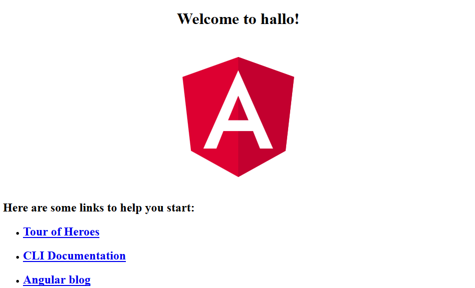

# Angular

## Kurzbeschreibung

Ermöglicht effizientere und leichtere Kommunikation zwischen HTML und JavaScript. Angular ist ein Open-Source-Framework zur Erstellung von browserbasierten Single-Page-Anwendungen und Web-Apps. Durch die Nutzung des Model View Controllers (MVC-Modell) wird die Softwareentwicklung und das Modultesten von Apps verbessert. Angular strukturiert sowohl den App-Aufbau als auch die Entwicklung effizienter und erleichtert die Kommunikation zwischen HTML und JavaScript.

## Erste Schritte

### Installation

Die Entwicklung mit Angular setzt folgende Abhängigkeiten voraus

1. Node.js

2. npm

Nachdem Node.js und npm installiert wurden, kann das Angular Projekt durch die Angular CLI  erstellt werden. Dafür ist es notwendig, diese zunächst durch 

```shell
> npm install @angular/cli -g
```

per npm zu installieren.

### Projekt erstellen

Um ein Angular Projekt zu erstellen, wechselt man zunächst in das gewünschte Zielverzeichnis. Anschließend wird per Angular CLI ein neues Projekt erstellt.

```shell
> ng new <Name_der_Applikation>
```

Im darauf folgenden Dialog können nun folgende zwei Einstellungen getroffen werden.

```shell
Would you like to add Angular routing? (y/N)
```

Beantwortet man mit `y`, stellt einem die Angular CLI ein Routing Gerüst zur Verfügung. Im nächstem Dialog kann daraufhin der gewünschte CSS-Präprozessor gewählt werden.

```
Which stylesheet format would you like to use?
```

Im Anschluss wird die Projektstruktur erstellt. Wechselt man nun in das neu erstellte Verzeichnis, kann mit

```bash
> ng serve
```

das Angular Projekt gestartet werden. Dieser Vorgang kann eine Weile dauern, da unter anderem TypeScript in JavaScript kompiliert werden muss. Die Standard Website kann nun unter `localhost:4200` im Browser aufgerufen werden.



## Das Herzstück

Das Herzstück einer Angular App ist standartmäßig die Datei `app.module.ts`, diese Datei kann jedoch auch umbenannt werden. Dort laufen alle Funktionalitäten auf unterschiedliche Weise zusammen. Alle Dateien werden über Imports eingebunden.

Beim Erstellen einer neuen Angular App über die Angular CLI werden in der `app.module.ts` zunächst die wichtigsten Module geladen.

```typescript
import { BrowserModule } from '@angular/platform-browser';
import { NgModule } from '@angular/core';

import { AppRoutingModule } from './app-routing.module';
import { AppComponent } from './app.component';

@NgModule({
  declarations: [
    AppComponent
  ],
  imports: [
    BrowserModule,
    AppRoutingModule
  ],
  providers: [],
  bootstrap: [AppComponent]
})
export class AppModule { }
```

**BrowserModule** dient dazu, die Anwendung zu starten.

**NgModule** stellt das Hauptmodul der Anwendung dar und erstellt das App-Modul. Beim Laden dieses Moduls wird der *AppComponent* gestartet, wie unter `bootstrap` angegeben.

**AppRoutingModule** ist optional und bietet die Möglichkeit, Inhalt in Abhängigkeit der aktuellen URL zu laden. Der Import dieser Datei kann schon während der Einrichtung über die Angular CLI erfolgen. Siehe Abschnitt *Projekt erstellen*.

**AppComponent** ist die Elternkomponente, welche alle weiteren App-Komponenten als Kind-Komponente enthält.

## Komponenten

Angular ist komponentenorientiert, die gesamte Anwendung ist zunächst eine Komponente, auch Top Level Komponente genannt. Darunter sind wieder weitere Komponenten die selbst auch wieder Komponenten beinhalten könnten. Eine Anwendung setzt sich somit aus vielen Komponenten zusammen. So existiert zum Beispiel für die Navigation, einzelne Unterseiten usw. eigene Komponenten.


Eine Komponenten besteht im wesentlichen aus 2 Teilen. Dem *Component Controller* welcher die Logik beinhaltet sowie einem *Template* welches für die Darstellung verantwortlich ist und üblicherweise aus HTML besteht. Des Weiteren gibt es eine CSS Datei welche nur für die entsprechende Komponente gilt.

Der Inhalt der *AppComponent* sieht wie folgt aus:

```typescript
import { Component } from '@angular/core';

@Component({
  selector: 'app-root',
  templateUrl: './app.component.html',
  styleUrls: ['./app.component.css']
})
export class AppComponent {
  title = 'Full-Stack';
}
```

Unter **selector** wird angegeben, wie dieses Modul eingebunden werden soll (HTML-Element oder HTML-Attribut). Die **templateUrl** und **styleUrls** beinhalten Pfade zum Template bzw. Stylesheet dieser Komponente. Es ist außerdem möglich, anstelle von Pfaden Inline Code zu verwenden. Dafür muss jedoch *templateUrl* in *template* und *styleUrls* in *styles* umgeschrieben werden.

### Eigene Komponenten

Über die Angular CLI können neue Komponenten generiert werden.

```shell
ng generate component <name_der_komponente>
```

Innerhalb eines neu erstellten Verzeichnisses unter `src/app` findet sich im Anschluss das Grundgerüst der neuen Komponente. Bequemer und schnell lässt sich dies jedoch über eine IDE generieren welche für Angular geeignet bzw. durch Plugins dafür erweitert wurde.

Durch die Angular CLI wird die Komponente automatisch in `app.module.ts` importiert und steht zur Verwendung bereit.

Möchte man nun den Inhalt der Komponente bzw. das Template anzeigen lassen, kann in der Datei `app.compent.html` das jeweilige Tag `<name-der-komponente></name-der-komponente>` hinzugefügt werden.

## Interpolation

Durch Interpolation kann innerhalb eines Templates dynamisch auf Eigenschaften eines Komponentenobjekts zugegriffen werden. Die Syntax sieht wie folgt aus: `{{ <name> }}`.

Auf nicht primitive Datentypen kann durch den Safe Navigation Operator `?.` zugegriffen werden.

Beispiel: `{{ film?.laenge }}`

Sollte der Datentyp nicht vorhanden sein, wird kein Fehler geworfen. Durch das Fragezeichen kann asynchrones Laden realisiert werden. Ist ein Datentyp während der Ladezeit noch nicht vorhanden, wird dieser nachgeladen und im nachhinein gerendert.

Des weiteren können durch `[]` bestehende HTML Tag weiterhin verwendet und dynamisch mit Properties aus der Komponente besetzt werden (Property binding). `<a [href]="<name_der_property>">...</a>`.

## Events

Durch Events könnten Methodenaufrufe innerhalb des Templates erzeugt werden. Je nach Art der Interaktiv kann demnach auf Events reagiert werden. Typische Anwendung findet zum Beispiel das click Event.

Im folgenden Beispiel wird auf den Klick eines Paragraphen die Methode `myClickHandler` aufgerufen.

```html
<p (click)="myClickHandler()"></p>
```

### Eventparameter

Übergibt man beim Aufruf einer Methode innerhalb des Templates das Eventobjekt, können innerhalb der Methode auf die Attribute des Eventobjekts zugegriffen werden.

```typescript
myClickHandler($event)
```

Schaut man sich den Inhalt des Event Objekts in der Konsole genauer an, fällt auf, dass dieses Objekt sehr viele Informationen bietet welche nützlich zur weiteren Verwendung sein können.

```json
MouseEvent {
    altKey: false
	bubbles: true
	button: 0
	buttons: 0
    cancelBubble: false
    cancelable: true
    clientX: 13
    clientY: 459
    ...
}
```

Innerhalb der Funktion kann wie bei jedem Objekt mit dem Punktoperator auf die Eigenschaften des Objekts zugegriffen werden.

### Elementreferenzen

Mit Elementreferenzen können komplette Elemente in einem Template referenziert werden.

Befinden sich innerhalb eines <a></a> Objekts zum Beispiel weitere Attribute kann mit einer Elementreferenz im weiteren Templare darauf zugegriffen werden. Eine Elementreferenz wird mit einem # vor dem Namen definiert.

```html
<a #link [href]="url">Google</a>
```

Per Interpolation kann nun auf einzelne Attribute des Objekts zugegriffen werden. Wird der Punktoperator nicht verwendet, kann auf alle Attribute des Tags zugegriffen werden. In diesem Fall wird das gesamte Objekt zurück gegeben.

```html
{{link.href}}
```

Liefert den Inhalt von href.

Elementreferenzen können nur lesend, jedoch nicht schreibend verwendet werden und sind somit also *read-only*.

## Strukturdirektiven

### For

Mit `*ngFor` kann innerhalb eines Templates eine For Schleife realisiert werden. Der Stern Operator `*` simbolisiert eine Strukturdirektive wie switch, if ect.. `ng` hingegen, das es sich dabei um Angular handelt.

Eine for-of Schleife lässt sich somit wie folgt realisieren.

```typescript
// Innerhalb der Komponente definiertes Array.
farben = ['Rot', 'Blau', 'Gruen'];
```

```html
<ol>
    <li *ngFor="let x of farben">{{x}}</li>
</ol>
```

Liefert folgendes Ergebnis im Browser:

```html
1. Rot
2. Blau
3. Gruen
```

Zur weiteren Nutzung stehen innerhalb der For-Schleife bestimmte bezeichner zur Verfügung. Mittels `odd, even, first, last und index` kann zum Beispiel auf weitere Eigenschaften zugefriffen werden.

```html
<ol>
    <li *ngFor="let x of farben index as i">{{i}}</li>
</ol>
```

Da even, odd, first und last jeweils einen boolischen Wert zurück liefern, kann im Anschluss mit einer If-Abfragen nach belieben gefilter werden.

### If

Eine mögliche Erweiterung könnte zum Beispiel wie folgt realisiert werden.

```html
<ol>
    <li *ngFor="let x of farben even as e">
        <span *ngIf="e; else other">{{x}}</span>
        <ng-template #other>Nicht gleich</ng-template>
    </li>
</ol>
```

Durch die `*ngIf` Bedingung wird der `ng-template` Tag nur dann gerendert, wenn die Bedingung false entspricht.

## Switch

```html
<ol>
    <li [ngSwitch]="lenght">
        <span *ngSwitchCase="1">Kurz</span>
        <span *ngSwitchCase="3">Mittel</span>
        <span *ngSwitchCase="5">Lang</span>
        <span *ngSwitchDefault>default</span>
    </li>
</ol>
```

Zunächst folgt ein Property binding um den Wert von lenght aus der Komponente zu laden. In den darauf folgenden Zeilen wird wie üblich eine Strukturdirektive vom Typ switch erzeugt. Es werden nur zutreffende Bereiche gerendert.

## Pipes

Durch Pipes können Funktionen auf Inhalte ausgeführt werden. Mehrere Funktionen können dabei im Aufruf kaskadiert werden.

```typescript
// Innerhalb der Komponente
name: String = 'Foo';

// Innerhalb des Templates
{{name | uppercase}}

// Ausgabe
FOO

// Kaskadierung
{{name | uppercase | json}}

// Ausgabe
"FOO"
```

## Class Binding

Damit CSS Klassen innerhalb einer Komponente gesetzt bzw. gesteuert werden können, bietet Angular verschiedene Möglichkeiten.

```html
<p [class.red]="isRed">Foo...</p>
```

Somit ist es möglich, innerhalb der Komponente der Wahrheitswert von `isRed` zu beeinflussen. Dies hat zur Folge, dass die Klasse aktiviert bzw. deaktiviert wird.

Hat ein Tag mehrere CSS Klassen die gesteuert werden sollen, biete Angular die Möglichkeit mit `ngClass` mehrere gleichzeitig zu setzen.

```html
<p [ngClass]="{klassenName1: isDisabled, green: isGreenActive, ...}"
```

## Routing

Damit Komponenten bzw. Inhalte durch Aufruf einer bestimmten URL gerendert werden können, muss in der `app.module.ts` zunächst das erforderliche Modul importiert werden.

```typescript
import { RouterModule } from '@angular/router';
```

Unter `imports` können dann Routen definiert werden, indem der Pfad und die aufzurufende Komponente angegeben wird.

```typescript
imports: [
    ...,
    RouterModule.forRoot([
      {
        path: '',
        component: SignInComponent
      },
      {
        path: '/foo',
        component: FooComponent
      },
      {
        path: '**',
        component: NotFoundComponent
      }
    ])
  ]
```

### Statisch

Damit beim Aufruf eines Links die Ressourcen der Seite nicht bei jeden Aufruf erneut geladen werden muss, gibt es bei Angular einige Änderungen. Statt `href` wird nun ein eigenes Attribut `routerLink` verwendet. Somit werden nur neue Ressourcen geladen.

Im Beispiel wird die Komponente `FooComponent` aufgerufen.

```html
<a routerLink="/foo">...</a>
```

### Dynamisch

Damit Links dynamisch erzeugt werden, wird auf Property Binding zurück gegriffen.

```html
<a [routerLink]="['/foo', user.id]">...</a>
```

In diesem Beispiel wird die Route `/foo` mit der Komponente `FooComponent` aufgerufen. Außerdem folgt mit einem weiteren `/` die ID der Users.

`localhost:4200/foo/1234`

#### Links

Mit `routerLinkActive` können CSS Klassen angegeben werden welche bei aktivem Zustand aktiviert werden. In folgendem Beispiel werden zwei Klassen verwendet.

```html
<li routerLinkActive="active current"><a routerLink="/foo">...</a></li>
```

### Services

Eine einfache Möglichkeit wiederverwendbare Programmteile auszulagern oder Daten zwischen Komponenten auszutauschen sind Services. Dabei sind Services nichts weiter als Klassen, die als Abhängigkeit in anderen Komponenten injiziert werden können. Es werden zwei Arten unterschieden.


### Dependency Injection

Das Konzept der Dependency Injection sieht vor, Abhängigkeiten von außen in eine Instanz zu übergeben und diese darin zu nutzen. Das Konzept besitzt Ähnlichkeiten mit den aus anderen Programmiersprachen bekannten *Singletons*. Bei Singletons wird innerhalb der Applikation eine Instanz, wenn diese noch nicht existiert, erzeugt. Diese wird dann an verschiedenen Stellen der Applikation genutzt. Dabei wird immer auf dieselbe Instanz zurückgegriffen, sofern diese noch existiert.

### Guard

Dieses Angular 2 Feature ist gerade bei sicherheitsrelevanten Daten oder Views sinnvoll, da man aufgrund eines Tokens oder eines bestimmten Claims im Token prüfen kann, ob der derzeitige Benutzer mit dem Token x auf eine bestimmte Route zugreifen darf.

## Quellen

[Angular University](https://angular-university.io/home)