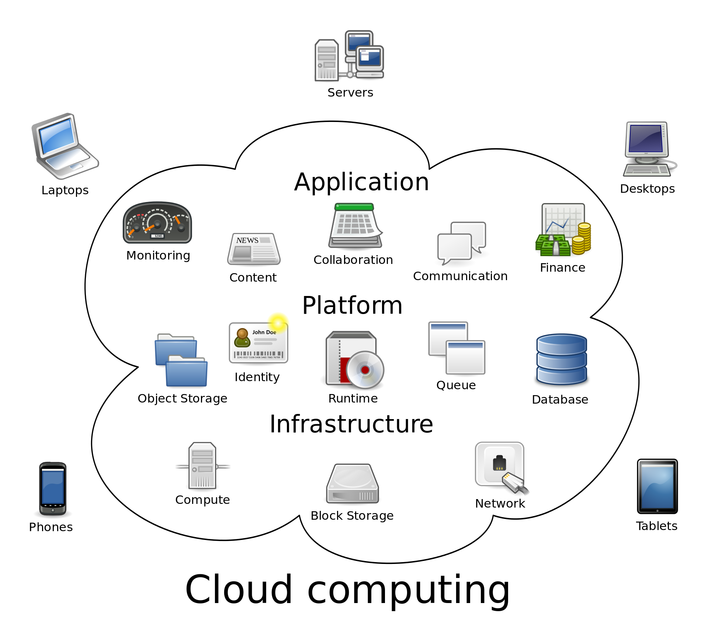
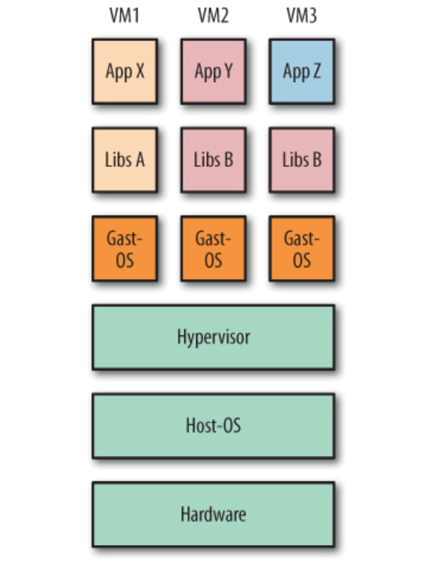
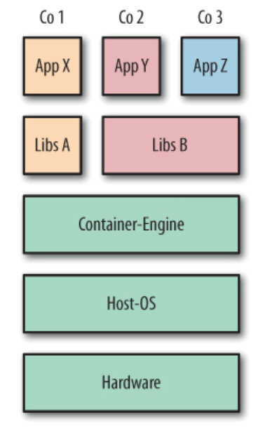
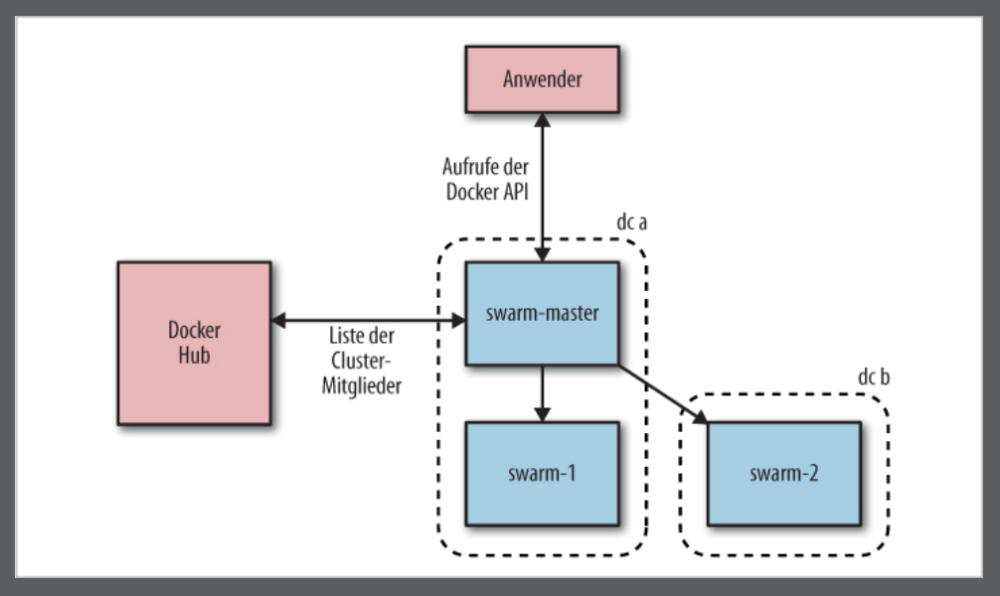
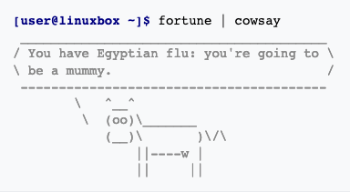
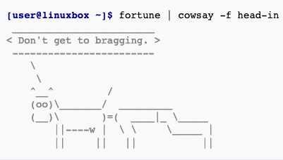

# Continuous Integration und Deployment

## Einleitung

Dieses Dokument enthält eine Zusammenfassung der wichtigsten Begriffe in Bezug auf automatische Build Prozesse der Softwareentwicklung. Als erstes gibt es eine Einführung in **Cloud Computing** und eine Erläuterung der Begriffe CI und CD. Darauf folgt die Vorstellung von den wichtigsten Tools in diesem Gebiet, sowie die jeweiligen Vor und Nachteile. In der Lehrveranstaltung "Fullstackdevelopment" wurde **Jenkins als CI/CD Tool** ausgewählt. Um automatische Build Prozesse auszuführen ist es hilfreich sich mit **Docker und der Containerisierung** zu beschäftigen, diese ermöglichen es eine flexible, leichtgewichtige  und saubere Build Umgebung zu erzeugen. Grundbegriffe und die wichtigsten Funktionen von Docker und Jenkins werden erläutert und abschließend am **Beispiel der Anwendung "coachr",** die auch Teil der Lehrveranstaltung ist, angewendet.

## Cloud Computing

Die Spannweite der Dienstleistungen die in einer Cloud angebotenen werden, umfasst das gesamte Spektrum der Informationstechnik und beinhaltet unter anderem Infrastruktur, Plattformen und Software.



**Buzzwords**

- **SaaS** (Anwendung) - z.B. GoogleDocs, GoogleMaps ...
- **PaaS** (Plattform) -  z.B. CI und CD
- **IaaS**  (Infrastruktur) - z.B. Digital Ocean, AWS, Azure

## CI und CD

**Was ist der Unterschied zwischen CI und CD?**

Diese Begriffe findet man häufig im Bereich der "**DevOps**", denn sie stellen Teilbereiche der Anwendungsentwicklung dar. CI/CD löst die Probleme, die die Integration von neuem Code für DevOps-Teams verursachen kann (auch bekannt als die „[Integrationshölle](https://www.solutionsiq.com/agile-glossary/integration-hell/)“).

**Continuous Integration**

Wenn mehrere Entwickler an einem Code arbeiten, ermöglicht CI diesen eine einfache Integration der unterschiedlichen Codebasen und ein einheitliches Build und Testsystem. 

**Continuous Delivery**

Ziel der Continuous Delivery ist eine Codebasis, die jederzeit für die Implementierung in einer Produktionsumgebung bereit ist. Der Entwicklercode wird dadurch dem Business-Team übergeben, der eine Grundlage zur Implementierung in der Produktion darstellt. 

**Continuous Deplyment**

Die abschließende Phase ermöglicht es den geprüften Code an den Kunden direkt auszuliefern. Diese Pipeline kann somit z. B. eine App direkt und voll automatisch in den Store laden.

### Tools + Vergleich

Es folgt eine Liste von CI-Tools mit einer kurzen Beschreibung und einigen Vor- bzw. Nachteilen. Es wurden nur frei nutzbare Tools in die Liste aufgenommen, da es ein schier grenzenlose Zahl von kommerziellen CI-Versionen gibt, die sich nur wenig unterscheiden oder spezielle Build Systeme bereitstellen.

**Jenkins**

Jenkins ist bei nahezu jeder CI-Tool-Liste die Nummer eins. Es ist frei zugänglich, sprich Open-Source und bietet durch seine Plugin-Infrastruktur die Möglichkeit seine Konfiguration an viele verschiedene Projekte (und Sprachen) anzupassen. Jenkins ist eine Java Applikation und hat auch seine Wurzeln bei der Firma "Sun Microsystems" die 2010 von Oracle aufgekauft wurde.

| Vorteile                                                   | Nachteile                                               | Abhängigkeiten                         |
| ---------------------------------------------------------- | ------------------------------------------------------- | -------------------------------------- |
| Sehr flexible an verschiedene Projekte anpassbar (Plugins) | Hoher Konfigurationsaufwand und Eigenleistung notwendig | Java Runtime Environment (Java 7 o. 8) |

**Travis CI / Circle CI**

Die beiden CI-Tools stellen ein Cloud-basierte Lösung eines Build und Deploysystem dar. Travis sowie Circle bieten die Nutzung für Open-Source-Projekte umsonst an die auf Github gehostet werden. Aber auch diese sind auf Build-Anzahl etc. beschränkt. Diese Tools nehmen einem sehr viel Denkarbeit ab und man kann sich aufs Wesentliche konzentrieren.

| Vorteile                                                     | Nachteile                                       | Abhängigkeiten |
| ------------------------------------------------------------ | ----------------------------------------------- | -------------- |
| Kommerzielles Self-Hosting möglich                           | Bei Free-Version auf Github Projekte beschränkt | Keine da PaaS  |
| Nimmt einem sehr viel Arbeit ab und ist schnell konfigurierbar |                                                 |                |
| Fast alle gängigen Programmiersprachen und Projekte möglich  |                                                 |                |

**Gitlab CI Community**

Gitlab CI stellt auch eine Cloud-basierte Lösung dar, bei der allerdings die Self-Hosted-Core Version gratis ist. Entwickelt wird Gitlab in Ruby und Go.

| Vorteile                                              | Nachteile                                     | Abhängigkeiten                                               |
| ----------------------------------------------------- | --------------------------------------------- | ------------------------------------------------------------ |
| Self-Hosted Git Server mit Issue Tracker, CI, CD .... | Höherer Konfigurationsaufwand bei Self-Hosted | Keine wenn PaaS                                              |
| Integrierter GitHub-Ersatz                            |                                               | Sonst siehe [Gitlab Install](https://about.gitlab.com/install/) |

## Jenkins

### Hosten

**Möglichkeiten Jenkins aufzusetzen**

Man kann Jenkins auf allen Systemen installieren, dafür benötigt man nur ein OS mit einem installierten Java (7 oder 8). Möchte man ein Build mit Docker-Containern ausführen, benötigt man natürlich auch noch eine lauffähige Docker-Umgebung.

[Getting started with Jenkins](https://jenkins.io/download/)

### Pipelines

In Jenkins arbeitet man mit sogenannten Pipelines. Sie können sehr flexibel eingesetzt und mit Plugins erweitert werden. Einfach gesagt führen sie die Schritte automatisch aus, die für ein Test-Build-Deploy-Prozess benötig werden. Es gibt zwei Möglichkeiten eine Pipeline zu benutzten:

**Jenkinsfile (Declarative Pipeline)**

```groovy
pipeline {
    agent none 
    stages {
        stage('Example Build') {
            agent { docker 'maven:3-alpine' } 
            steps {
                echo 'Hello, Maven'
                sh 'mvn --version'
            }
        }
        stage('Example Test') {
            agent { docker 'openjdk:8-jre' } 
            steps {
                echo 'Hello, JDK'
                sh 'java -version'
            }
        }
    }
}
```

**Jenkinsfile (Scripted Pipeline)**

```groovy
node {
    stage('Example') {
        if (env.BRANCH_NAME == 'master') {
            echo 'I only execute on the master branch'
        } else {
            echo 'I execute elsewhere'
        }
    }
}
```

Note: Liegt das Jenkinsfile im Wurzelverzeichnis des Repositorys, erkennt Jenkins das und für diese Schritte aus.

### Plugins

Es gibt unzählige Erweiterungen für Jenkins (mehr unter [Jenkins Plugins](https://plugins.jenkins.io/)). Als Anfänger sollte man allerdings die empfohlenen Plugins wählen. Erwähnenswert ist das Plugin **Blue Ocean**, dass eine sehr ansprechende Oberfläche bietet und den CI-CD Prozess übersichtlich darstellt.

## Docker

Docker biete eine einfache Lösung den Softwareentwicklungsprozess schneller, ressourcenschonender und flexibler zu machen. Konfigurationsmanagement, einrichten einer Entwicklungsumgebung, Beachtung von Abhängigkeiten, Isolierung von Prozessen etc., sind Arbeiten die in jedem neuen oder auch bestehenden Projekt anfallen. Docker bietet die Möglichkeit diese in Containern zu verpacken und gleichzeitig transportabel und wiederverwendbar zu machen.  

Die Docker-Plattform besteht vereinfacht gesagt aus zwei getrennten Komponenten: der **Docker Engine**, die für das Erstellen und Ausführen von Containern verantwortlich ist, sowie dem **Docker Hub**, einem Cloud Service, um Container-Images zu verteilen.

[Docker CE installieren](https://docs.docker.com/install/)

### Containerisierung

**VM-Stack**



**Container-Stack**



**Geringer Overhead**

Container teilen sich Ressourcen mit dem Host-Betriebssystem, wodurch sie um eine wesentliche Größenordnung effizienter sind als virtuelle Maschinen. Container können im Bruchteil einer Sekunde gestartet und gestoppt werden. 

Administratoren können viel mehr Container auf einer einzelnen Host-Maschine laufen lassen, als dies mit VMs möglich wäre.

**Portierbarkeit**

Benutzer können komplexe Anwendungen herunterladen und laufen lassen, ohne sich Stunden mit Konfiguration und Installation herumzuschlagen. Umgekehrt brauchen sich die Entwickler solcher Anwendungen nicht mehr um solche Unterschiede in den Benutzerumgebungen.

Die Portierbarkeits- und Isolationsgarantien von Containern vereinfachen die Zusammenarbeit mit anderen Entwicklern und Administratoren: Entwickler können sicher sein, dass ihr Code in allen Umgebungen laufen wird, während sich die Administratoren auf das Hosten und Orchestrieren von Containern konzentrieren können, statt sich mit dem Code herumschlagen, der darin läuft.

**Kein Hypervisor**

Prozesse, die innerhalb von Containern laufen, entsprechen nativen Prozessen auf dem Host.

**Ermöglicht Microservices**

Monolithische Softwaresysteme wie z. B. Eine Java-Anwendung können nur hoch skaliert werden, also mehr RAM oder mehr Rechenleistung. Microservices hingegen lassen sich in der Breite skalieren, in dem man einfach die auftretende Last auf mehrere Rechner, mit gleichen Voraussetzungen verteilt. 

### Docker-Hub

Der Docker-Hub ist ein öffentliches Repository für Container. Jeder kann dort seine erstellten Images veröffentlichen. Einige Softwarehersteller bieten aber Images an, die von ihnen selbst gewartet werden (z. B. MySQL). Dafür benötigt man einen Account, den man sich unter https://hub.docker.com erstellen kann.

Die Kommandozeilenbefehle ähneln denen von Git:

- `docker push <repositoryname>/<imagename>:<tagname>`
- `docker pull <repositoryname>/<imagename>:<tagname>`
- Im Dockerfile gibt man noch den Maintainer an
  - `MANTAINER Alexander Bergmann alex.bergmann87@gmail.com`

**Registry**

Ein Service, der für das Hosten und Verteilen von Images zuständig ist. Die Standard-Registry ist der Docker Hub.

**Repository**

Eine Sammlung zusammengehöriger Images (oft handelt es sich um verschiedene Versionen der gleichen Anwendung oder des gleichen Service)

**Namespaces**

Diese Verwendung von Namensräumen sorgt dafür, dass die Anwender von Namensräumen sicher sein können, woher Images kommen. Zusätzlich können Images auch kryptographisch signiert werden, um eine bessere Authentizität sicherzustellen. Dabei spricht man von Trusted Images.

Root - Die Docker eigenen Repositorys z. B. debian

User - Die Nutzer eigenen Repositorys z. B. abergy/cowsay

Selfhosted - Selbst gehostete Repositorys, diesen geht eine IP voraus z. B. 192.168.1. 20/cowsay

### Docker Compose



Docker Compose dient zur Orchestrierung/Verbindung von Container-Clustern. Dabei nutzt es **Docker Swarm**, eine native Clustering-Lösung von Docker, die zur Installaltionsumgebung gehört. Das Herzstück von Docker Compose ist eine YAML Datei, sie enthält die nötigen Informationen um die Container zu starten, zu verbinden oder zu bauen. 

```yaml
# docker-compose.yml
mynginx:
  image: nginx
  ports:
  	- "80:80"
  	- "443:443"
  volumes:
  	- /var/www/my_project:/var/www/project1
  links: myphp-fpm
myphp-fpm:
  image: php:fpm
  volume-from:
  	- mynginx
 
########## BUILD ######
nginx:
	build: nginx/
```

**Docker Compose Befehle**

| Befehl                     | Beschreibung                                                 |
| -------------------------- | ------------------------------------------------------------ |
| docker-compose up          | Erzeugt und startet die Container, die im YAML File definiert sind |
| docker-compose ps          | Listet die aktiven Container auf die con Docker Compose gestartet wurden |
| docker-compose start/ stop | Einzelne Container stoppen (docker-compose ps)               |
| docker-compose rm          | Entfernt Container(docker-compose ps)                        |
| docker-compose build       | Baut alle Container zusammen und tagged diese dann, sodass sie beim nächsten Starten schneller verfügbar sind. |

**Kubernetes**

Kubernetes ist ein Tool zur Containerorchestrierung von Google, dabei handelt es sich um eine ausgefeiltere Orchestrierungslösung auf höherem Niveau, die auch Failover- und Skalierungs-features mitbringt und auch auf anderen Clustering-Lösungen aufsetzen kann. Es geht seine eigenen Wege und erzwingt eine Reihe von Konzepten rund um die Organisation und das Vernetzen von Containern.

 (http://kubernetes.io)

### Docker-Image erstellen

**What are fortune and cowsay ?**





#### Dockerfile

| Befehl     | Beschreibung                                                 |
| ---------- | ------------------------------------------------------------ |
| FROM       | Setzt das Basis-Image für das Dockerfile, nachfolgende Anweisungen bauen auf diesem Image auf. `IMAGE:TAG` |
| RUN        | Führt die angegebene Anweisung im Container aus und bestätigt das Ergebnis |
| COPY (ADD) | Kopiert Dateien aus dem Build Context, in das Image. `ADD` ist ähnlich, aber mächtiger. `COPY src dest` oder `COPY ["src", "dest"]` möglich |
| ENTRYPOINT | Legt eine ausführbare Datei (und Standardargumente) fest, die beim Start des Containers laufen soll |
| CMD        | Führt die angegebene Anweisung aus, wenn der Container gestartet wurde. Wird auch als Argument für `ENTRYPOINT` verwendet |
| VOLUME     | Deklariert die angegebene Datei oder das Verzeichnis als Volume |
| WORKDIR    | Setzt das Arbeitsverzeichnis für den aktuellen RUN/CMD Befehl |
| USER       | Setzt den Benutzer (über Name oder UID), der in folgenden RUN-, CMD- oder ENTRYPOINT-Anweisungen genutzt werden soll |

Weitere Befehle: `ARG ENV EXPOSE HEALTHCHECK MAINTAINER LABEL ONBUILD SHELL STOPSIGNAL`

Notes:

- Sowas wie `../another_dir/myfile` funktioniert im Dockerfile nicht
- Die `FROM` Anweisung ist immer die erste in einem Dockerfile
- Es ist zu beachten, dass UIDs auf Host und Container die gleichen sind, die Benutzernamen aber verschiedenen UIDs zugewiesen sein können – Mögliche Fehlerquelle beim setzen von Berechtigungen

**Beispiele:**

Möglichst einfach:

```bash
# Dockerfile
FROM debian:wheezy

RUN apt-get update && apt-get install -y cowsay fortune
```

```bash
docker build -t test/cowsay-dockerfile .
docker run test/cowsay-dockerfile /usr/games/cowsay “Muh“
```

Etwas flexibler, mit `ENTRYPOINT`:

```bash
#!/bin/bash
# entrypoint.sh
if [ $# -eq 0 ]; then
    /usr/games/fortune | /usr/games/cowsay
  else
    /usr/games/cowsay “$@”
fi
```

```bash
# Dockerfile
FROM debian:wheezy

RUN apt-get update && apt-get install -y cowsay fortune
COPY entrypoint.sh /

ENTRYPOINT [“/entrypoint.sh”]
```

```bash
docker build -t test/cowsay-dockerfile .

docker run test/cowsay-dockerfile 
# oder
docker run test/cowsay-dockerfile Hallo Muh
```

## Beispiel: coachr 


### Server einrichten

Die Serverinstanzen wurden mit AWS erstellt, die Einrichtung und Konfiguration hier aufzuführen würde den Rahmen diese Beispiels sprengen. Nachfolgend werden die Kommandozeilenbefehle der einzelnen Instanzen aufgelistet, nach dem man sich erfolgreich per SSH darauf verbunden hat.

*Note*: Der Befehl `sudo yum update -y` wird in jeder Instanz als erstes ausgeführt.

**EC2-instance-coachr-frontend**

```bash
# Docker installieren
sudo amazon-linux-extras install docker -y
sudo service docker start
sudo usermod -a -G docker ec2-user
docker info
# Funktioniert der Befehl docker info ohne sudo nicht, dann muss die Instanz neustarten werden 
# nach dem Neustart muss der Docker-Daemon wieder gestartet werden
```

```bash
# Container starten
docker run -p 80:80 -d --name coachr -v /home/ec2-user/app/dist:/usr/share/nginx/html -t nginx
# Die erfolgreich getestete und gebaute Anwendung wird von Jenkins in den Ordner ~/app deployed und an den Contanier weitergereicht 
```

**EC2-instance-Jenkins**

```bash
# Jenkins installieren
sudo wget -O /etc/yum.repos.d/jenkins.repo http://pkg.jenkins.io/redhat/jenkins.repo
sudo rpm --import https://pkg.jenkins.io/redhat/jenkins.io.key      
sudo yum install jenkins -y
# Jenkins ist eine Java Anwendung und benötigt mindestens Java 7, nutzt man Pipeline mit Git muss auch das installiert werden
sudo yum install java-1.8.0-openjdk.x86_64 -y
# Git
sudo yum install git -y

########### Docker installieren --> EC2-instance-coachr-frontend ###########

# Jenkins User brachen Zugriff auf den docker Befehl
sudo usermod -a -G docker jenkins
# Anschließend Jenkins starten und sich das Initialpasswort anzeigen lassen
sudo service jenkins start
sudo cat /var/lib/jenkins/secrets/initialAdminPassword
# Jetzt ist der Server per http://<server-url>:8080 zu erreichen
```

**EC2-instance-backend**

```bash
# TODO:
docker run -p 5432:5432 --rm --name coachr-db -e POSTGRES_PASSWORD=testsystem -d postgres
```

**Dotnet Umgebung**

```bash
git clone http://www.github.com/AHeinisch/coachr-backend

docker run -it --rm -v ~/coachr-backend:/coachr-backend -p 80:80 --name coachr-api mcr.microsoft.com/dotnet/core/sdk

docker cp appsettings.json bdec403902e3:/coachr-backend/src

dotnet restore

dotnet bin/ ... /coachr-backend.dll
```

### Jenkins

#### Konfiguration

#### Pipelines einrichten

#### Github Hok einrichten 

### Continuous Integration in Aktion


## Quellen

**Cloud, CI , CD**

- [50 CI Tools](https://stackify.com/top-continuous-integration-tools/)
- [Jenkins in Docker und mit Docker und für Docker](https://www.oose.de/blogpost/jenkins-in-docker-und-mit-docker-und-fuer-docker/)
- [CircleCI vs Travis CI vs Jenkins](https://hackernoon.com/continuous-integration-circleci-vs-travis-ci-vs-jenkins-41a1c2bd95f5)
- [Wikipedia](https://de.wikipedia.org/wiki/Cloud_Computing)

**Jenkins**

- [Dokumentation](https://jenkins.io/doc/)

**Docker**

- Adrian Mouat: Docker – Software entwickeln und deployen mit Containern. dpunkt.verlag 2016, ISBN 978-3-86490-384-7
