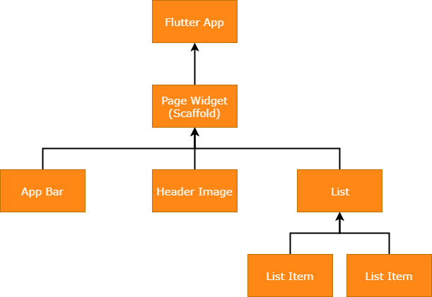

# Flutter

## Was ist Flutter?
[Flutter](https://flutter.dev/) ist ein SDK für Android und iOS Apps. Der größte Vorteil ist, dass die Apps sich eine, in [Dart](https://www.dartlang.org/) geschriebene, Codebase teilen und dann in die jeweiligen nativen Sprachen, Java und Swift, übersetzt werden. Dabei wird die Designsprache, des jeweiligen Systems, nicht verletzt. Das Resultat ist eine performante App mit plattformkonsistentem Design, die durch verhältnismäßig wenig Programmieraufwand entsteht. Flutter besteht aus C / C++, Dart und Skia (2D Grafikengine).

Minimale Systemanforderungen:
+ iPhones 4S mit iOS 8
+ Android 4.1.x und Gerät mit ARM Prozessor


### Vorteile
+ Native Performance
+ Eine Codebase für Android und iOS
+ Gute Dokumentation

### Nachteile
+ Um für jede Plattform das entsprechende Design zu realisieren, muss der Gerätetyp abgefragt und im Code unterschieden werden
+ Alle Designelemente sind nur Reproduktionen der nativen API-Elemente
+ Bringt keine Schnittstelle zur Hardware mit

### Vergleich mit anderen Frameworks
| Name             | Performance | Designelemente                                                              | Programmier-/Skriptsprache | Kompatibilität mit weiteren Frameworks |
| ---------------- | ----------- | --------------------------------------------------------------------------- | -------------------------- | -------------------------------------- |
| **Flutter**      | nativ       | reproduziert, Unterscheidung notwendig                                      | Dart                       | -                                      |
| **Ionic**        | hybride App | reproduziert, Unterscheidung nicht notwenig                                 | JavaScript, TypeScript     | Angular, Vue, React                    |
| **NativeScript** | nativ       | nativ                                                                       | JavaScript, TypeScript     | Angular, Vue                           |
| **React Native** | nativ       | teilweise nativ, teilweise reproduziert, Unterscheidung teilweise notwendig | JavaScript, TypeScript     | -                                      |

## Workflow
Nach der Installation von Flutter wird zunächst ein neues Projekt erzeugt. Dieses automatisch erzeugte Projekt bringt bereits eine Testapp mit an der man sich orientieren kann.

```bash
flutter create new_app
```

### iOS
Vorraussetzungen: Mac OSX, Xcode

#### Simulation
```bash
open -a Simulator
flutter run
```

#### USB-Debugging
Zunächst muss man sich mit seiner Apple-ID bei Xcode anmelden und ein iOS-Entwickler Zertifikat generieren. Danach das iPhone an den Mac anschließen, als *Target* auswählen und mit `flutter run` den Buildprozess und die Übertragung starten. Danach erscheint die App auf dem Homebildschrim des iPhones.

> Beim Debugging mit Xcode ist es sehr wichtig sich in den Einstellungen mit einer Apple-ID anzumelden. Das ist notwenig um eine Signatur für die App zu generieren. Ein kostenpflichtiges Developer Enrollment wird erst benötigt wenn die App über den AppStore vertrieben werden soll, jedoch nicht für die Entwicklung. Des Weiteren ist darauf zu achten, dass im Target unter Xcode der *Bundle Identifier* eine eindeutige Identifikation beinhaltet (`com.example.test` oder `com.test.app` reichen nicht aus).


### Android
Vorraussetzung: Android Studio

#### Simulation
Als erstes erstellt man in Android Studio, unter *AVD Manager*, ein virtuelles Gerät und startet dieses. Danach kann man mit `flutter run` die App builden und auf das virtuelle Gerät übertragen.

#### USB-Debugging
Zunächst ist es notwendig USB-Debugging in den Entwickleroptionen am Gerät zu aktivieren. Daraufhin kann das Smartphone per USB an PC oder Mac angeschlossen werden und mit `flutter run` den Buildprozess und die Übertragung starten. Das Zielsystem wird dabei automatisch ausgewählt.


## Aufbau einer Flutter App
**Grundprinzip: Alles ist ein Widget**

Widgets sind die Grundbausteine des gesamten UIs. Jedes Widget liegt innerhalb eines übergeordneten Widgets und erbt dessen Eigenschaften. Somit nutzt Flutter (und auch React) das Coposite Pattern, wobei die Widgets den Components entsprechen. Sogar die denkbar einfachste App erbt von einem anderen Widget.

```dart
import 'package:flutter/material.dart';

void main() => runApp(MyApp());

class MyApp extends StatelessWidget {
  @override
  Widget build(BuildContext context) {
    return MaterialApp(
      title: 'Welcome to Flutter',
      home: Scaffold(
        body: Center(
          child: Text('Hello World'),
        ),
      ),
    );
  }
}
```

Bei der Beispielapp liegt in dem App-Widget ein Scaffold-Widget und in diesem wiederum App-Bar, Header-Image und List. So wird Schritt für Schritt (bzw. Widget für Widget) das UI aufgebaut.




## Stateless vs. Stateful
Man unterscheidet Widgets hauptsächlich zwischen stateless und stateful. Wenn ein Widget sich verändert, z.B. durch Benutzerinteraktion, ist es stateful.

### Stateless
Ein **StatelessWidget** ändert sich nicht und die zugehörigen Attribute sind *immutable*. Zustandlose Widgets sind z.B. Icons oder Texte.

### Stateful
Ein **StatefulWidget** ist dynamisch. Es kann bei Bedarf auslösen, dass es neu gerendert wird. So werden z.B. Änderungen einer Variable auf dem Bildschirm dargestellt. Der Zustand eines solchen Widgets wird in einem Objekt **State** gespeichert, um die Zustandsinformationen von der Darstellung zu trennen. **State** besteht aus veränderbaren Werten, wie z.B. der aktuelle Wert eines Sliders. Wenn sich der Zustand eines Widgets ändert, ruft **State** die Methode `setState()` auf um das entsprechende Widget neu zu rendern.

## Layout
UI-Layout werden in Flutter durch *Rows* und *Columns* realisiert. Im folgenden Beispiel wird aus einigen simplen Widgets ein komplexeres Widget geschaffen. Durch den *Container* ist es möglich dem Kind des Containers, Eigenschaften wie z.B. Abstände oder Rahmen zuzuweisen. Es gibt eine Auswahl an vorgefertigten Layout-Widgets, die viele Layoutarten abdeckt. Darunter u.a. Raster und scrollbare Listen.

  


## Navigation und Routing
In Flutter übernimmt der `Navigator` die Verwaltung von *Routen*. *Routen* bezeichnet dabei die verschiedenen Seiten der App. Der `Navigator` funktioniert wie ein Stack, auf dem Objekte vom Typ `Route` abgelegte werden und immer das oberste Objekt auf dem Bildschirm dargestellt wird. Der `Navigator` stellt außerdem zwei Methoden bereit `Route`-Objekte zu verwalten: `Navigator.push` und `Navigator.pop`. *Routen* können benannt werden und miteinander kommunizieren. *Navigatoren* können ineinander verschachtelt werden.


## Flutter für Desktopanwendungen
Es ist möglich mit Flutter eine Desktopanwendung zu programmieren, die aus einer Codebase, ausführbare Programme für MacOS, Linux und Windows erzeugt (vergleichbar mit [Electron](https://electronjs.org/)). Dafür kann man auf die Projekte [Flutter Desktop Embedding](https://github.com/google/flutter-desktop-embedding) oder [Go-Flutter](https://github.com/go-flutter-desktop/go-flutter) zurückgreifen. Grundsätzlich funktionieren diese beiden Projekte gleich, sie stellen eine Schnittstelle zwischen der *Flutter Engine* und dem jeweiligen Betriebsystem bereit. Code ist mit dem mobilen Framework kompatibel und kann damit geteilt werden solange keine Hardwarefunktionen aufgerufen werden.

# Dart
Dart ist eine objektorientierte Programmiersprache. Sie wird primär für mobile- und web-Apps verwendet, kann aber auch serverseitig eingesetzt werden. 

## Syntax und Semantik
```dart
void main() {
  print('Hello World!');
}
```

### Variablen
Bei der Deklaration von Variablen muss kein expliziter Typ angegenben werden, da es Typinferenz gibt.

Standard Datentypen:
+ Integer
+ Double
+ String
+ Boolean
+ List (Array)
+ Set
+ Map
+ Rune (Darstellung von Unicodezeichen in einem String)

> Variablen, die nicht initialisiert wurden, haben immer den Wert *null* (auch numerische Typen).

```dart
var name = 'Max Mustermann';
var year = 1995;
var height = 1.85;
var favFoods = ['Pizza', 'Coffee','Icecream'];
var image = {
  'tags': ['face'],
  'url': '//path/to/face.jpg'
};
```

### Kontrollfluss
Dart unterstützt folgende Kontrollflussanweisungen:
+ `if` und `else`
+ `for`
+ `while` und `do-while`
+ `break` und `continue`
+ `switch` und `case`
+ `assert`
 
```dart
if (year >= 2001) {
  print('21. Jahrhundert');
} else if (year >= 1901) {
  print('20. Jahrhundert');
}

for (var object in favFoods) {
  print(object);
}

for (int month = 1; month <= 12; month++) {
  print(month);
}

while (year < 2016) {
  year += 1;
}
```
### Funktionen
Zusätzlich zur klassichen Schreibweise wird auch die kürzere, mit Pfeilsyntax (`=>`), unterstützt. Die Pfeilsyntax ist besonders nützlich, wenn anonyme Funktionen als Argumente übergeben werden. Anzumerken ist außerdem, dass die top-level Funktion `print()` als Argument für `forEach()` übergeben werden kann.
```dart
int fibonacci(int n) {
  if (n == 0 || n == 1) return n;
  return fibonacci(n - 1) + fibonacci(n - 2);
}

var result = fibonacci(20);

favFoods.where((name) => name.contains('zz')).forEach(print);
```

### Kommentare
```dart
// einzeiliger  Kommentar

///
/// dokumentations Kommentar
///

/*
 * mehrzeiliger Kommentar
 */
```

### Imports
```dart
// Kernbibliotheken
import 'dart:math';

// Bibliotheken aus externen Paketen
import 'package:test/test.dart';

// Dateien
import 'path/to/my_other_file.dart';
```

Falls man zwei Bibliotheken, mit widersprüchlicher Identifikation, importiert, kann ein **Bibliothekspräfix** den Konflikt auflösen.
```dart
import 'package:lib1/lib1.dart';
import 'package:lib2/lib2.dart' as lib2;

// Benutzt Element aus lib1
Element element1 = Element();

// Benutzt Element aus lib2.
lib2.Element element2 = lib2.Element();
```

Mit `show` und `hide` ist es möglich nur **Teile einer Bibliothek** zu importieren.
```dart
// Importiert nur foo
import 'package:lib1/lib1.dart' show foo;

// Importiert alles außer foo
import 'package:lib2/lib2.dart' hide foo;
```

Dart unterstütz **verzögertes Laden** (*deferred loading* / *lazy loading*). Das erlaubt dem Programm das Laden von Bibliotheken aufzuschieben, bis/falls sie benötigt werden. Die Verwendung von verzögertem Laden kann die initiale Ladezeit eines Programms verringern. Im folgenden Beispiel wird die Funktion `printGreeting()` aus dem Package `greetings` erst während der Laufzeit geladen.

> In der Dart-VM (verwendet für Debugging) weicht das Verhalten von verzögertem Laden von der Spezifikation ab. Dort ist ist bereits vor dem Aufruf von `loadLibrary()` möglich auf die Bibliothek zuzugreifen.

```dart
import 'package:greetings/hello.dart' deferred as hello;

Future greet() async {
  await hello.loadLibrary();
  hello.printGreeting();
}
```

### Klassen
In dem unten stehenden Beispiel ist eine Klasse mit zwei Konstruktoren, einer Methode und 3 Eigenschaften. Eine der Eigenschaften ist nur durch eine *Get-Methode* definiert.
```dart
class Spacecraft {
  String name;
  DateTime launchDate;

  // Konstruktor
  Spacecraft(this.name, this.launchDate);

  // benannter Konstruktor; leitet zum "default" weiter
  Spacecraft.unlaunched(String name) : this(name, null);

  int get launchYear =>
      launchDate?.year;

  // Methode
  void describe() {
    print('Spacecraft: $name');
    if (launchDate != null) {
      int years =
          DateTime.now().difference(launchDate).inDays ~/
              365;
      print('Launched: $launchYear ($years years ago)');
    } else {
      print('Unlaunched');
    }
  }
}

var voyager = Spacecraft('Voyager I', DateTime(1977, 9, 5));
voyager.describe();

var voyager3 = Spacecraft.unlaunched('Voyager III');
voyager3.describe();
```

### Vererbung
In Dart gibt es nur Einfachvererbung.
```dart
class Orbiter extends Spacecraft {
  num altitude;
  Orbiter(String name, DateTime launchDate, this.altitude)
      : super(name, launchDate);
}
```

### Mixins
Mit Mixins kann Code in komplexeren Klassenhierarchien wiederverwendet werden. Im folgenden Beispiel ist die Klasse `Piloted` ein Mixin und gewährt der Klasse `PilotedCraft` so Zugriff auf die Variable `astronauts` und die Methode `describeCrew`. Mit `mixin` anstatt `class` kann verhindert werden, dass Piloted als normale Klasse verwendet wird. Zusätlich kann mit dem optionalen `on` eingeschränkt werden auf welche Klassen das Mixin angewendet werden kann.
```dart
class Piloted {
  int astronauts = 1;
  void describeCrew() {
    print('Number of astronauts: $astronauts');
  }
}

class PilotedCraft extends Spacecraft with Piloted {
  // ···
}
```

### Asynchrone Programmierung
Asynchrone Programmierung lässt das Programm weitere Aufgaben erledigen, während auf das Beenden einer Operation gewartet wird. `Future` stellt dabei das Ergebnis einer asynchronen Operation dar.

```dart
Future checkVersion() async {
  var version = await lookUpVersion();
  // Do something with version
}

Future<String> lookUpVersion() async => '1.0.0';
```

**Quellen:**  
https://www.dartlang.org/guides/language/language-tour  
https://facebook.github.io/react-native/docs/getting-started  
https://ionicframework.com/docs  
https://docs.nativescript.org/  
