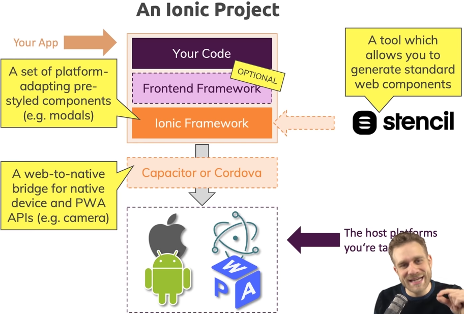
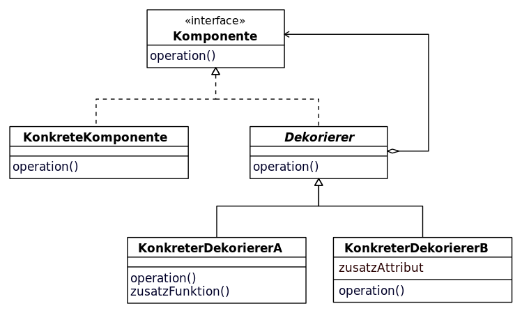

# Ionic

## Was ist Ionic?

[Ionic](https://ionicframework.com/) ist ein Open-Source-Webframework zur Realisierung von sogenannten hybriden und progressiven Webapplikationen. Durch HTML5. CSS, Sass und Javascript/TypeScript ermöglicht diese Technologie, die Implementierung einer plattformunabhängigen mobilen App, welche sich wie eine native Applikation für den Anwender anfühlt.

Angular JS ist ein elementares Element von Ionic und erzeugt die Struktur der App, während das Ionic Framework der Realisierung des Front-Ends dient.

Ein weiteres Feature ist, dass die Apps auch im jeweiligen App-Store der entsprechenden Plattform zur Verfügung gestellt werden können.

Unterstüzt werden Android, iOS und mit Ionic 2 auch UWP für Windows 10 und die Implementierung einer Electron-Desktop-App.

Systemanforderungen: min. iOS7+ und Android 4.1+

## Arten von mobilen Anwendungen

### Native Apps

Native Apps werden zugeschnitten auf die jeweilige Plattformen entwickelt. Sie nutzen die Hardware wie Kamera, GPS oder Sensoren des Endgerätes optimal. Jede Plattform benötigt individuellen Code. Das führt in der Entwicklung und in der späteren Pflege zu einem höheren Aufwand. Native Apps besitzen maximale Performance Möglichkeiten. Sie werden aus einem sogenannten Store bezogen und können hierdurch installiert werden.

#### Android

Android ist ein sehr verbreitetes Betriebssystem (Marktanteil 2016: 87,5%) des Google Konzerns für mobile Geräte. Apps die hierfür entwickelt werden, können im "Google Play Store" vertrieben werden. Apps werden meist in Java geschrieben und zu einer ".apk" Datei kompiliert.

#### iOS

Apple verwendet für seine mobilen Geräte ihr eigenes Betriebssystem iOS. Das Betriebssystem ist im Gegensatz zu Android auch ausschließlich für Apple Geräte verfügbar.Entwickelt wird meist in Objective-C, C und C++. Die Apps werden nach einer Prüfung durch Apple im "App-Store" angeboten.

#### Universal Windows Platform

UWP ermöglicht das Entwickeln von Applikationen, welche auf diversen Windows 10-Hardware-Umgebungen ausführbar sind. Das Besondere hierbei ist, dass der Quellcode nur einmal geschrieben wird und dabei nicht extra für die Zielplattform(en) angepasst werden muss.

### Web Apps

Web Apps ermöglichen die Entwicklung von plattformübergreifenden Anwendungen. Hierbei handelt es sich im Grunde um eine Website, welche in die Hülle einer nativen App gepackt wird. Durch Plugins lassen sich hardwarenahe Funktionalitäten in die Anwendung integrieren. Web Apps können ebenfalls wie native Apps über einen Store beziehen.

#### Progressive Web App

PWA's sind im Grunde Webseiten, welche sich für den Anwender aber wie eine App anfühlen. Ein sogenannter "Service-Worker" bietet hierbei die Möglichkeit, dass die App auch offline funktioniert. Der große Vorteil ist, dass eine mehrfache Entwicklung einer Applikation/Website überflüssig wird. HTML5, CSS3 und JavaScript ermöglichen die Realisierung einer PWA.

### Hybride Apps

Hybride Apps vereinen die Vorteile von Web- und nativen Apps. Sie werden mit nativem Code geschrieben und mit HTML5-Elementen ergänzt.Der native Code ermöglicht den Zugriff auf die Hardware und nutzt smoit die Vorteile der einzelnen Plattformen. Die hybride App wird ebenfalls über den Store auf dem Endgerät installiert.


## App Arten im direkten Vergleich:

|                        | Native App      | Web App         | Hybride App |
| ---------------------- | --------------- | --------------- | ----------- |
| Performance            | maximal         | minimal         | mittel      |
| Plattformunabhängikeit | nicht vorhanden | maximal         | maximal     |
| Hardwarezugriff        | maximal         | nicht vorhanden | maximal     |
| App-Store-Vertrieb     | ja              | nein            | ja          |
| Kostenpunkt            | maximal         | gering          | mittel      |
| Offline-Funktionalität | ja              | ja              | ja          |

## Apache Cordova

Ionic basiert auf dem Apache Cordova Cross-Plattform-Entwicklungsframework für mobile Anwendungen. Es nutzt HTML5, CSS3 und JavaScript. Die Anwendungen werden innerhalb von Wrappern ausgeführt, die auf jede Plattform ausgerichtet sind, und verlassen sich auf standardkonforme API-Bindungen, um auf die Funktionen der einzelnen Geräte zuzugreifen.

### Capacitor

Capacitor ist eine Alternative zu Cordova und dient ebenfalls als plattformübergreifende API- und Codeausführungsebene, die es einfach macht, Native SDKs aus dem Webcode aufzurufen und benutzerdefinierte native Plugins zu schreiben. Desweiteren unterstützt Capacitor die Entwicklung progressiver Web Apps. Capacitor bietet volle Kompatibilität zu Cordova Plugins. Android Plugins werden in Java und Kotlin geschrieben. iOS Plugins lassen sich in Objective-C realisieren. Capacitor kann man wie eine "native App-Hülle" um den eigentlichen Web-Code verstehen. Bei Capacitor handelt es sich um eine eigene Implementierung des Ionic-Entwicklerteams.

## Web-Komponenten

Ionic stellt eine Reihe an vorgefertigten und vielseitig einsetzbaren Web-Komponenten zu verfügung. Eine Komponente besteht aus HTML, CSS und einem individuellem JavaScript, welches seine eigene Logik beinhaltet. So wäre z.B. ein Menütab eine solche immer wieder verwendbare Web-Komponente.

### Stencil

Stencil soll die besten Konzepte aus gängigen Frontend-Frameworks in einem vereinen. Es ist komponentenbasiert und lässt sich in allen gängigen Frontend-Frameworks wie React, Angular, Vue und Ember integrieren. Es ermöglicht die Verwendung von vorgefertigten Web-Komponenten und auch die Implementierung eigener Komponenten.

## Zusammenspiel



## Workflow

Zu beginn steht die Einrichtung von Cordova via Node-Package-Manager an.

```
$ npm install -g ionic cordova
```

Cordova ist das Framework, welches erst ermöglicht, dass die Apps nicht in ihrer nativen Programmiersprache geschrieben werden müssen.

Der nächste Schritt erzeugt eine simple "Hallo-Welt" Applikation.

```
$ ionic start helloWorld blank --type=ionic-angular
```

Zum Ausführen wechselt man in das Projektverzeichnis und startet die Applikation via "ionic serve".

```
$ cd helloWorld
$ ionic serve
```

## Entwicklerumgebung

Als IDE bietet sich Ionic Studio an, welches auf der selben Basis wie Visual Studio Code aufbaut. Es bietet TypeScript sowie Autocompletion- und Debugging-Features, kostet jedoch Geld.

## Appflow

Appflow dient der vereinfachten Verwaltung einer Anwendung in ihrer Entwicklung. Diese Verwaltung ist vom Open-Source-Framework getrennt. Appflow soll bei der Erstellung nativer Appbuilds helfen und Live-Code-Aktualisierungen bereitstellen.

## Projektstruktur

### CLI - "ionic generate" - Kommando

Der Befehl "ionic generate" erlaubt das automatisierte Erzeugen von diversen Ionic Elementen. Die Ausführung des Kommandos, lässt das CLI ein Template der jeweiligen Auswahl, im Projektordner erzeugen.

Der Aufbau des Kommandos ist wie folgt:

```
$ ionic generate \<type> \<name> [options]
```

#### Page

Bei einer "Page" handelt es sich im wesentlichen um eine View. Eine Page Komponente setzt sich aus den folgenden Elementen zusammen, welche ihr eigenes Aussehen und Verhalten definiert.

- .module.ts:

- .page.html:

  - Definiert die Layoutstruktur der View in HTML.

- .page.scss:

  - Ermöglicht die Definition von individuellen Styles innerhalb der View. Es wird so z.B. ermöglicht, dass Buttons eine besondere Farbe aufweisen.

- .page.spec.ts:

- .page.ts:
  - Erlaubt die Implementierung von Logik innerhalb der Page. Es ist in TypeScript implementiert und liefert somit diverse Möglichkeiten aus der OOP-Welt, wie Vererbung oder die Implementierung von Interface's, desweiteren bietet es auch einen Konstruktor. "ngOnInit()" ist eine Funktion, welche beim Initialisierungsvorgang der Page ausgeführt wird.

#### Service

Ein Service beinhaltet selbstdefinierbare Funktionalitäten, welche an mehreren Stellen in der Applikation wiederverwendet werden können. So sorgt ein Service z.B. für die konsistente Datenhaltung über mehrere Pages. Der Vorteil ist, dass so redundanter Code, für die eine Funktionalität, auf mehreren Pages, vermieden werden kann.

Ein Service besteht aus den folgenden Elementen:

- service.spec.ts:

- service.ts:
  - Enthält die Logik, welche über mehrere Komponenten geteilt werden kann.

Ein Service verwendet das Dekorierer-Muster und referenziert stets auf die "@Injectable()" Methode.

Beispie service.ts:

```javascript
import { Injectable } from "@angular/core";

@Injectable()
export class SomeService {
  constructor() {}

  someFunction() {
    console.log("I do something useful!");
  }
}
```

##### Decorator-Muster



Ein Dekorierer bietet den Vorteil, dass große Vererbungshierarchien vermieden werden. Aber vorallem ermöglicht es in diesem Zusammenhang, dass Funktionalitäten zur Laufzeit durch den "Dekorierer" flexibel ausgetauscht werden können.

##### Einbinden des Services

1. Importieren des Services:

```typescript
import { SomeService } from "./../../services/some.service";
```

2. Instanzieren im Konstruktor:

```typescript
constructor(private someService: SomeService) { }
```

3. Verwenden der bereitgestellten Methode:

```typescript
this.someService.someFunction();
```

Beispiel:

```typescript
import { SomeService } from "./../../services/some.service";
import { Component, OnInit } from "@angular/core";

export class SomePage implements OnInit {
  constructor(private someService: SomeService) {}

  ngOnInit() {}

  runService() {
    this.someService.someFunction();
  }
}
```

### Navigation

#### Routing

Die Routen der Pages werden in der "app-routing-module.ts" Datei definiert. Das Modul enthält ein Array vom Type "Routes" über dessen Eigenschaften sich die jeweiligen Routen der Pages bestimmten lassen.

Auszug:

```javascript
const routes: Routes = [
  { path: "", redirectTo: "login", pathMatch: "full" },
  { path: "login", loadChildren: "./login/login.module#LoginPageModule" },
  {
    path: "register",
    loadChildren: "./register/register.module#RegisterPageModule"
  }
];
```

Das Schlüssel-Wert-Paar "path" erlaubt die Bestimmung der jeweiligen Route.
Das erste Element des Arrays verweist mit "redirectTo" auf die Login-Page der Applikation. Dies bedeutet, dass beim ersten Öffnen der Applikation direkt auf die Login-Page verwiesen wird.

#### Verknüpfung von Pages

Das HTML-Attribute "routerLink" ermöglicht die einfache Navigation zwischen diversen Pages. Das Attribute lässt sich an vielen Elementen einfach hinzufügen (z.B. in Buttons) und hat als Wert die Route auf die es beim Auslösen des Elements verweisen/weiterleiten soll.

Beispiel:

```html
<ion-button [routerLink]="['/login']">Registrieren</ion-button>
```

### Asynchrone Programmierung

Die asynchrone Programmierung ist ein elementarer Bestandteil moderner Webtechnologien. Sie ermöglicht eine effiziente und parallele Abarbeitung von Algorithmen. So würde ein System ohne diese Möglichkeit, z.B. bei einer HTTP-GET-Anfrage ohne asynchrone Implementierung, bis zum Zeitpunkt einer Antwort, auf weitere Interaktionen des Benutzers, nicht reagieren werden können.

Ein Problem das hieraus resultert ist, dass es einen größeren Implementierungsaufwand erfordert, denn es muss ein Mechanismus geschaffen werden, welcher auf das Fertigstellen einer Aufgabe reagieren kann.

### Callbacks

Ein Callback ist die einfachste Lösung, um mit der Fertigstellung einer asynchronen Aufgabe umzugehen. Die Idee ist hierbei, dass eine Funktion als Parameter übergeben wird, welche beim
Abschließen der Aufgabe aufgerufen wird.

Beispiel:

```javascript
downloadPhoto("http://coolcats.com/cat.gif", handlePhoto);

function handlePhoto(error, photo) {
  if (error) console.error("Download error!", error);
  else console.log("Download finished", photo);
}

console.log("Download started");
```

Vorteil:

- einfach zu implementieren

Nachteil:

- kann schnell unübersichtlich werden

Negativ Beispiel:

```javascript
fs.readdir(source, function(err, files) {
  if (err) {
    console.log("Error finding files: " + err);
  } else {
    files.forEach(function(filename, fileIndex) {
      console.log(filename);
      gm(source + filename).size(function(err, values) {
        if (err) {
          console.log("Error identifying file size: " + err);
        } else {
          console.log(filename + " : " + values);
          aspect = values.width / values.height;
          widths.forEach(
            function(width, widthIndex) {
              height = Math.round(width / aspect);
              console.log(
                "resizing " + filename + "to " + height + "x" + height
              );
              this.resize(width, height).write(
                dest + "w" + width + "_" + filename,
                function(err) {
                  if (err) console.log("Error writing file: " + err);
                }
              );
            }.bind(this)
          );
        }
      });
    });
  }
});
```

### Promise

Durch ein Promise lassen sich groß verschachtelte und so auch unübersichtliche Verkettungen von asynchronen Methodenaufrufen, welche durch Callbacks realisiert werden, vermeiden. Das folgende Beispiel macht dies deutlich.

Callback-Implementierung:

```typescript
myAwesomeFunction(function(x) {
  mySecondFunction(x, function(y) {
    myThirdNestedFunction(y, function(z) {
      // here we handle the results of the 3 chained functions.
    });
  });
});
```

Promise-Implementierung:

```typescript
// our original promise function
myAwesomeFunction()
  // on completion would trigger this
  .then(function(result) {
    // which would in turn return another promise
    return mySecondFunction(result);
  })
  // which on completion would trigger this
  .then(function(result2) {
    // which would again return a promise
    return myThirdNestedFunction(finalResult);
  })
  // before finally executing this block
  .then(function(finalResult) {
    // and in here we could play with the result
    // of all three promise calls
    console.log(finalResult);
  })
  // within here we could catch any errors
  // in our above promises
  .catch(function(error) {
    console.log(error);
  });
```

Es wird schon in diesem kurzen Beispiel deutlich, dass durch die Promise-Implementierung, die Lesbarkeit des Codes erhöht wird. Spätestens im Umgang mit Exceptions wird dies sehr schnell klar.

#### Aufbau:

```typescript
function myAsyncRequest(uri) {
  return new Promise((resolve, reject) => {
    let image = new Image();

    image.onload = function() {
      resolve(image);
    };

    image.onerror = function() {
      reject(new Error("Could not load image with URI " + uri));
    };

    image.src = uri;
  });
}

myAsyncRequest("https://this.is.my/uri/to/my/image.jpg")
  .then(image => {
    console.log(image);
  })
  .catch(error => {
    console.log(error);
  });
```

Das obige Beispiel zeigt eine eigene Implementierung eines Promise und dessen Verwendung.
Zur eigenen Implementierung eines Promise, benötigt der dazugehörige Klassenkonstruktor stets 2 Übergabeparameter.

Der "resolve" Parameter enthält bei erfolgreicher Ausführung der Methode, das Ergebnis und wird somit im ".then" Aufruf verfügbar.

Genauso verhält es sich mit dem "reject" Parameter, nur dass es sich hierbei um ein Fehlerobjekt bei misserfolg der Methode handelt, welche über die Methode ".catch" verfügbar wird.

#### Async Await:

```typescript
function scaryClown() {
  return new Promise(resolve => {
    setTimeout(() => {
      resolve("🤡");
    }, 2000);
  });
}

async function msg() {
  const msg = await scaryClown();
  console.log("Message:", msg);
}

msg(); // Message: 🤡 <-- after 2 seconds
```

Das Schlüsselwort "await" sorgt dafür, dass die aufrufende Methode ("msg()"), ihre eigene Ausführung pausiert und auf die aufzurufende Promise Methode ("scaryClown()") bis zu ihrer Fertigstellung abwartet, um dann erst den eigenen Code fortzusetzen.

Mit "async" muss jede Methode markiert werden, welche eine "await" Anweisung enthält.

### Observerables

Ein Observerable stellt eine ".subscribe()" Methode bereit, welche die folgenden 3 Callbacks entgegennehmen kann.

- onNext (wird ausgeführt, wenn das Observable einen Wert ausgibt)
- onError (wird ausgeführt, wenn das Observable einen Error auslöst, der nicht abgefangen wird)
- onComplete (wird einmalig ausgeführt, wenn das Observable als fertig markiert wird)

Das Observerable lässt sich in einen Promise umwandeln und deshalb auch durch die Methode "toPromise()" genauso wie dieser Verwenden. In diesem Fall ignoriert es den "onNext()" Callback und stellt für "resolve" den "onComplete" Callback bereit und für "reject" den "onError".

Durch die Eigenschaft, dass Observerables durch den "OnNext" Callback auf einzelne Ereignisse reagieren können, eigenen diese sich hervorragend zur Realisierung von Streams.

#### Aufbau:

```typescript
const countObservable = new Observable(observer => {
  let i = 0;
  while (i <= 3) {
    observer.next(i++);
  }
  observer.complete();
});

countObservable.subscribe(
  result => {
    console.log(result);
  },
  error => {
    console.error(error);
  },
  () => {
    console.log("observable completed");
  }
);

//Output: 0
//Output: 1
//Output: 2
//Output: 3
//Output: observable completed
```

#### Anwendungsübersicht:

|                                            | Callbacks | Promise | Async-Await | Observerables                   |
| ------------------------------------------ | --------- | ------- | ----------- | ------------------------------- |
| Simpel implementierbar                     | x         |         |             |
| Bessere Lesbarkeit                         |           | x       | x           | x                               |
| Pausierbare nebenläufige Ausführung        |           | x       | x           | x (durch Umwandlung zu Promise) |
| Eventbasiertes Handling (z.B. für Streams) |           |         |             | x                               |

Notizen:

https://rathes.me/blog/de/javascript-promise-introduction

https://wiki.selfhtml.org/wiki/JavaScript/Promise

https://medium.com/@abampakos/from-callback-hell-to-observable-heaven-769a95c1e289

https://www.lise.de/blog/article/angular2-und-der-einstieg-in-die-welt-von-rxjs/

https://www.buschmais.de/2018/05/08/einfuehrung-in-rxjs/
