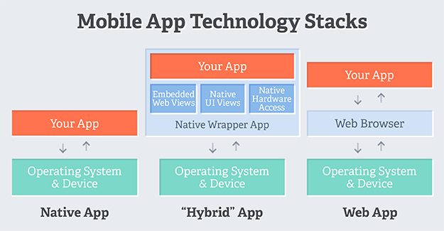

# Ionic

## Was ist Ionic?
[Ionic](https://ionicframework.com/) ist ein Open-Source-Webframework zur Realisierung von sogenannten hybriden und progressiven Webapplikationen. Durch HTML5. CSS, Sass und Javascript/TypeScript ermöglicht diese Technologie, die Implementierung einer plattformunabhängigen mobilen App, welche sich wie eine native Applikation für den Anwender anfühlt.

Angular JS ist ein elementares Element von Ionic und erzeugt die Struktur der App, während das Ionic Framework der Realisierung des Front-Ends dient.

Ein weiteres Feature ist, dass die Apps auch im jeweiligen App-Store der entsprechenden Plattform zur Verfügung gestellt werden können.

Unterstüzt werden Android, iOS und mit Ionic 2 auch UWP für Windows 10.

Systemanforderungen: min. iOS7+ und Android 4.1+

## Arten von mobilen Anwendungen

### Native Apps
Native Apps werden zugeschnitten auf die jeweilige Plattformen entwickelt. Sie nutzen die Hardware wie Kamera, GPS oder Sensoren des Endgerätes optimal. Jede Plattform benötigt individuellen Code. Das führt in der Entwicklung und in der späteren Pflege zu einem höheren Aufwand. Native Apps besitzen maximale Performance Möglichkeiten. Sie werden aus einem sogenannten Store bezogen und können hierdurch installiert werden.

#### Android
Android ist ein sehr verbreitetes Betriebssystem (Marktanteil 2016: 87,5%) des Google Konzerns für mobile Geräte. Apps die hierfür entwickelt werden, können im "Google Play Store" vertrieben werden. Apps werden meist in Java geschrieben und zu einer ".apk" Datei kompiliert.

#### iOS
Apple verwendet für seine mobilen Geräte ihr eigenes Betriebssystem iOS. Das Betriebssystem ist im Gegensatz zu Android auch ausschließlich für Apple Geräte verfügbar.Entwickelt wird meist in Objective-C, C und C++. Die Apps werden nach einer Prüfung durch Apple im "App-Store" angeboten.

#### Universal Windows Platform
UWP ermöglicht das Entwickeln von Applikationen, welche auf diversen Windows 10-Hardware-Umgebungen ausführbar sind. Das Besondere hierbei ist, dass der Quellcode nur einmal geschrieben wird und dabei nicht extra für die Zielplattform(en) angepasst werden muss.

### Web Apps
Web Apps ermöglichen die Entwicklung von plattformübergreifenden Anwendungen. Hierbei handelt es sich im Grunde um eine Website, welche in die Hülle einer nativen App gepackt wird. Durch Plugins lassen sich hardwarenahe Funktionalitäten in die Anwendung integrieren. Web Apps können ebenfalls wie native Apps über einen Store beziehen.

#### Progressive Web App
PWA's sind im Grunde Webseiten, welche sich für den Anwender aber wie eine App anfühlen. Ein sogenannter "Service-Worker" bietet hierbei die Möglichkeit, dass die App auch offline funktioniert. Der große Vorteil ist, dass eine mehrfache Entwicklung einer Applikation/Website überflüssig wird. HTML5, CSS3 und JavaScript ermöglichen die Realisierung einer PWA.

### Hybride Apps
Hybride Apps vereinen die Vorteile von Web- und nativen Apps. Sie werden mit nativem Code geschrieben und mit HTML5-Elementen ergänzt.Der native Code ermöglicht den Zugriff auf die Hardware und nutzt smoit die Vorteile der einzelnen Plattformen. Die hybride App wird ebenfalls über den Store auf dem Endgerät installiert.



## Apache Cordova
Ionic basiert auf dem Apache Cordova Cross-Plattform-Entwicklungsframework für mobile Anwendungen. Es nutzt HTML5, CSS3 und JavaScript. Die Anwendungen werden innerhalb von Wrappern ausgeführt, die auf jede Plattform ausgerichtet sind, und verlassen sich auf standardkonforme API-Bindungen, um auf die Funktionen der einzelnen Geräte zuzugreifen.

### Capacitor
Capacitor ist eine Alternative zu Cordova und dient ebenfalls als plattformübergreifende API- und Codeausführungsebene, die es einfach macht, Native SDKs aus dem Webcode aufzurufen und benutzerdefinierte native Plugins zu schreiben. Desweiteren unterstützt Capacitor die Entwicklung progressiver Web Apps. Capacitor bietet volle Kompatibilität zu Cordova Plugins. Android Plugins werden in Java und Kotlin geschrieben. iOS Plugins lassen sich in Objective-C realisieren.

### Stencil
Stencil soll die besten Konzepte aus gängigen Frontend-Frameworks in einem vereinen. Es ist komponentenbasiert und lässt sich in allen gängigen Frontend-Frameworks wie React, Angular, Vue und Ember integrieren.

## Workflow
Zu beginn steht die Einrichtung von Cordova via Node-Package-Manager an.

```
$ npm install -g ionic cordova
```

Cordova ist das Framework, welches erst ermöglicht, dass die Apps nicht in ihrer nativen Programmiersprache geschrieben werden müssen.

Der nächste Schritt erzeugt eine simple "Hallo-Welt" Applikation.

```
$ ionic start helloWorld blank --type=ionic-angular
```

Zum Ausführen wechselt man in das Projektverzeichnis und startet die Applikation via "ionic serve".

```
$ cd helloWorld
$ ionic serve
```

## Entwicklerumgebung

Als IDE bietet sich Ionic Studio an, welches auf der selben Basis wie Visual Studio Code aufbaut. Es bietet TypeScript sowie Autocompletion- und Debugging-Features, kostet jedoch Geld.

## Appflow
Appflow dient der vereinfachten Verwaltung einer Anwendung in ihrer Entwicklung. Diese Verwaltung ist vom Open-Source-Framework getrennt. Appflow soll bei der Erstellung nativer Appbuilds helfen und Live-Code-Aktualisierungen bereitstellen.
