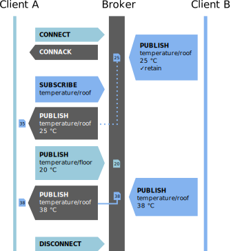

# MQTT

http://www.hivemq.com/demos/websocket-client/

https://www.hivemq.com/mqtt-toolbox/

## Beschreibung

**Message Queuing Telemetry Transport** (kurz MQTT) ist ein einfach aufgebautes Publish-Subscribe-Protokoll zum Nachrichtenaustausch im Netzwerk. Es benötigt sehr wenig Bandbreite und Funktion auf den Clients, bietet aber trotzdem eine hohe Zuverlässigkeit bei der Nachrichtenübermittlung. Nachrichten werden in sog. Topics, die man sich wie eine Ordnerstruktur vorstellen kann, einsortiert.

### Topologie 

 [^1]

Das Herzstück von MQTT ist der **Broker**, der die Topics und alle darin enthaltenen Nachrichten verwaltet und den Zugriff der einzelnen Clients auf diese regelt.

Die Clients kommunizieren nie direkt miteinander, sondern immer nur mit dem und über den Broker. Es gibt zwei Arten von Clients im MQTT-Protokoll:

- **Publisher**: Veröffentlicht (regelmäßig) Messdaten o.ä. unter einem bestimmten Topic des Brokers.
- **Subscriber**: Abonniert Topics und bekommt vom Broker daraufhin Nachricht über neue Veröffentlichungen darin.

Es ist durchaus möglich, dass der gleiche Rechner oder Microcontroller sowohl Publisher als auch Subscriber ist.

### Topics

Wie oben schon kurz erwähnt sind Topics wie eine Ordnerstruktur zu verstehen. Die Topics ermöglichen es dem Broker die Nachrichten von den und für die jeweiligen Clients zu gruppieren, zu sortieren und zu filtern.

[^2]

Topics bestehen jeweils aus einer oder mehreren Ebenen (Level) und diese Ebenen werden durch einen Schrägstrich ("/") getrennt.

#### Wildcards

Um flexibler zu sein und mehrere Topics abonnieren zu können, können die Subscriber Wildcards verwenden.

[^2]

Das "+"-Zeichen kann **genau ein** Level in der Topic-Hierarchie ersetzen und kann auch mittendrin platziert werden.

 [^2]

Das "#"-Zeichen dagegen muss immer **am Ende** des abonnierten Topics stehen. Der abonnierende Client erhält daraufhin alle Nachrichten der Topics, die so anfangen wie alles vor der Raute. Dabei ist es ganz egal welche oder wie viele Level dahinter noch folgen.

### Ablauf

[^3]

#### QoS - Quality of Service [^4]

- Bei der der niedrigsten Stufe 0 handelt es sich im Prinzip um eine *fire'n'forget*-Semantik. Es gibt also keine Garantie, dass die Nachricht überhaupt ankommt. 
- Bei QoS-Level 1 ist sichergestellt, dass die Nachricht mindestens einmal in der Topic-Queue landet (*At-least-once*-Semantik). 
- In der höchsten Stufe 2 garantiert der Broker sogar *exactly-once*: die Nachricht wird also genau einmal abgelegt, nicht öfter und nicht weniger

## Quellen

[^1]: Topologie: https://www.dataweek.co.za/9101a
[^2]: Topics: https://www.hivemq.com/blog/mqtt-essentials-part-5-mqtt-topics-best-practices/
[^3]: By Simon A. Eugster - Own work, CC BY-SA 4.0, https://commons.wikimedia.org/w/index.php?curid=70622928
[^4]: QoS: https://www.heise.de/developer/artikel/Kommunikation-ueber-MQTT-3238975.html