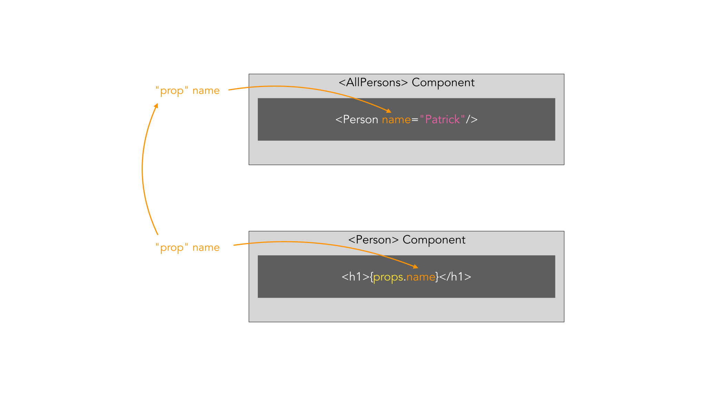
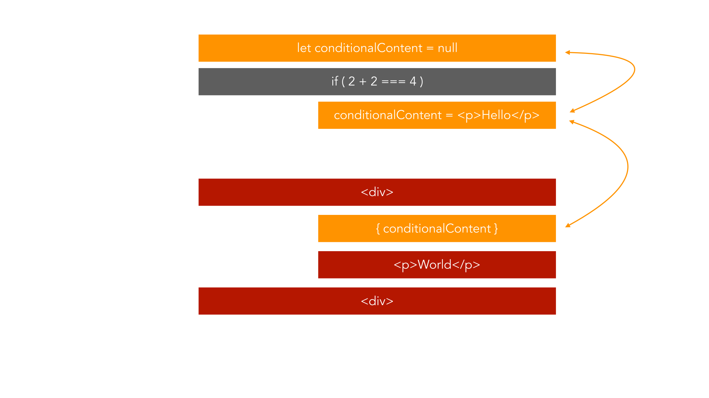

# React

## Was ist React?

React ist ein JavaScript Framework für die Erstellung von
Benutzeroberflächen. Es ist eins der größten JavaScript Frameworks neben
Angular und Vue.js. React steht aktuell bei der Version 16.8.6 vom 27.
März 2019, die neusten Neuerungen sind die sogenannten Hooks welche
später genauer erläutert werden.

## Anforderungen

React bietet große Möglichkeiten SPA (_Singe Page Application_) und MPA
(_Multi Page Application_) zu erstellen, aber um mit React einem guten
Workflow nachgehen zu können benötigt man etwas Vorwissen. Man sollte
wissen wie sich der neue JavaScript Standard (_ES6_) verhält und was
genau der Unterschied zwischen SPA und MPA ist.

## Workflow

Die Dependencies spielen eine große Rolle in der heutigen Zeit von
JavaScript um dort den Überblick und den bestmöglichen Komfort zu haben
benutzen wir einen sogenanntes Dependency Managment Tool. In unserem
Fall nutzen wir den Node Package Manager (_npm_). Wir nutzen einen
sogenannten Bundler der aus all unseren Dateien ein kompaktes Produkt
formt, hier zu nutzen wir Webpack. Um wie oben, in den
[Anforderungen](#anforderungen) angesprochen, ES6 verwenden zu können
benötigen wir einen Compiler, dieser sorgt dafür das aus ES6 gängiges
JavaScript wird und es für jeden Browser verständlich ist. Diese Arbeit
nimmt uns bei React ein Tool ab, dieses Tool nennt sich
[create-react-app](https://github.com/facebook/create-react-app).

```bash
npm install -g create-react-app
create-react-app test-react-app
```

Um die App im Browser richtig darstellen zu können starten wir den
mitgebrachten Webserver über npm, die App ist dann über
[localhost:3000](http://localhost:3000) erreichbar. __Bei einer Änderung
an unserer App wird diese automatisch neu erstellt.__

```bash
npm start
```

## Components

Komponenten sind das grundlegendste in React auch bekannt als
__Components__, aus einzelnen Components wird unsere App am Ende
zusammengesetzt. Der Vorteil an Components sind das man sie immer wieder
verwenden kann. Jede Component muss zwingend JSX zurückgeben oder diesen
rendern.


Der allgemeine Aufbau eines Components (_src/App.js_) in React sieht wie
folgt aus:

```js
import React, { Component } from 'react';
import './App.css';

class App extends Component {
  render() {
    return (
      <div className="App">
        <h1>Hello World</h1>
      </div>
    );
  }
}

export default App;
```

### Funktionale Components

Diese bezeichnet man als Präsentations- oder zustandslose Components, da
sie in den meisten Fällen nur JSX zurückgeben. Diese Art sollte so oft
wie nur möglich verwendet werden und gilt als Best-Practice.

```js
import React from 'react';

const foobar = () => {
  return <p>Foobar!</p>
};

export default foobar;
```

### Klassenbasierte Components

Diese bezeichnet man als Container- oder Zustandscomponents, diese
verwendet man wie der Name schon sagt wenn man Zustande in der Component
speichern möchte.

```js
import React, { Component } from 'react';

class Foobar extends Component {
  render() {
    return <p>Foobar!</p>;
  }
}

export default Foobar;
```

Um eigene Components dann zu verwenden kann man diese einfach einbinden
und aufrufen. Hier zu nutzen wir das funktionale Component aus dem
Beispiel über uns und importieren es in unsere `App.js`.

```js
import React, { Component } from 'react';
import './App.css';
import Foobar from './Foobar';

class App extends Component {
  render() {
    return (
      <div className="App">
        <h1>Hello World</h1>
        <Foobar />
      </div>
    );
  }
}

export default App;
```


## JSX

JSX ist die Sprache die zum darstellen von unseren Components verwendet
wird, um genauer zu sagen den Teil den wir in die `render()`-Methode
schreiben, man kann natürlich auch einfach so JSX-Code zurückgeben ohne `render()`-Methode.

```js
render() {
 return (
   <div className="App">
     <h1>Hello World</h1>
   </div>
 );
}
```

Damit wir dort JSX verwenden können importieren wir auch `React` in
unserem Component. React erstellt dann aus dem JSX für den Browser
lesbares JavaScript. Als Beispiel zeige zeige ich euch wie der obere
Code als normales JavaScript aussieht und was React intern mit JSX
macht.

```js
render() {
 return React.createElement('div', 
                            { className: 'App' }, 
                            React.createElement('h1', null, 'Hello World'));
}
```

JSX hat aber ein paar kleine Einschränkungen, es sieht zwar aus wie HTML
und es verhält sich auch in den meisten Fällen so, weswegen wir auch zum
Beispiel `className` nutzen anstatt die normale HTML-`class`, weil JSX
intern immer noch zu JavaScript kompiliert wird und `class` unter
JavaScript eine andere Verwendung findet. Außerdem kann man unter JSX im Normalfall
nur ein HTML Element zurückgeben, am folgenden Beispiel sieht man wie es
__nicht__ funktioniert.

```js
render() {
 return (
   <div className="App">
     <h1>Hello World</h1>
   </div>
   <p>I'm not working</p>
 );
}
```

Aus diesem Grund packt man um ein Component immer ein HTML-Element und
fügt sein Kontent in dieses HTML-Element oder man nutzt `React.Fragment` anstatt es
in ein `<div></div>` zupacken.


## Properties

Eigenschaften, auch __Properties__ oder Props genannt, bieten uns die
Möglichkeit unseren Inhalt der Components dynamisch anpassbar zu machen.
Diese kann man einfach bei den Aufruf des Components übergeben.

```js
<Foobar foo="bar" />
<Foobar foo="bar" >Foobar</Foobar>
```



Diese Properties kann man dann einfach innerhalb des Components
verwenden. Im zweiten Aufruf übergeben wir etwas nicht als Attribut,
dies kann man einfach über `.children` aufrufen.  
__Wichtig:__ Sollte man dasselbe bei einem klassenbasierten Component
machen, dann muss man in dem unten gezeigten Beispiel `this.props.foo`
verwenden.

```js
import React from 'react';

const foobar = (props) => {
  return (
    <div>
      <p>Foo{props.foo}!</p>
      <p>{props.children}</p>
    </div>
  );
};

export default foobar;
```

### State-Property

Die State-Property ist eine besondere Property in React, sie
funktioniert wie ein Objekt in JavaScript, du kannst Sachen drin
speichern und Abrufen. Das besondere daran ist das wenn du den Inhalt
ändert löst das ein rendern im UI aus.

```js
class App extends Component {
  state = {
    foo: [
        'bar'
    ]
  }
    
  render() {
    return (
      <div className="App">
        <h1>Hello World</h1>
        <Foobar foo={this.state.foo[0]} />
      </div>
    );
  }
}
```

Um dafür zu sorgen das React das Ändern des State-Property mitbekommt
biete uns React, durch die Vererbung von `Component`, die Methode
`this.setState`. Diese Methode fügt dann das alte State-Property und das
neue State-Property zusammen, es werden nur die Objekte verändert die
auch wirklich durch `this.setState` verändert wurden.

Um States unter funktionalen Components verwenden zu können benutzt man
`useState`, hier ist aber wichtig das das neue State-Property das alte
__überschreibt__. `useState` kann dafür beliebig oft verwendet werden.

## Event-Handling

Event Handling ist unter React relativ ähnlich zum Event-Handling unter
JavaScript. Am folgenden Beispiel wird gezeigt wie das Event-Handling
unter React im Allgemeinen aussieht. Event-Handler können auch über
Properties weitergegeben werden.

```js
class App extends Component {
  eventHandler = () => {
    console.log('Button was clicked!');
  }
    
  render() {
    return (
      <div className="App">
        <button onClick={this.eventHandler}>Button</button>
      </div>
    );
  }
}
```

Für weitere Events siehe
[React Docs](https://reactjs.org/docs/handling-events.html).


## Lists

Dieser Teil wird erklären wir man Werte von Forms verändern kann, wie
If-Bedingungen und For-Schleifen unter React verwendet werden können.

### Two-Way Databinding

Im Vergleich zu Angular besitzen wir hier kein ngModel welches uns die
Arbeit dafür abnimmt das heißt wir müssen selbst auf Änderungen
reagieren und Werte setzen.

Als erstes benötigen wir einen Event-Handler um auf diese Aktion
reagiert, also wenn etwas in das Input-Feld etwas eingetragen wird, in
dem Beispiel wollen wir einen Namen in unserer State-Property ändern.

```js
nameChangedHandler = ( event, id ) => {
  const personIndex = this.state.persons.findIndex(p => {
    return p.id === id;
  });

  const person = {
    ...this.state.persons[personIndex]
  };

  person.name = event.target.value;

  const persons = [...this.state.persons];
  persons[personIndex] = person;

  this.setState( { persons: persons } );
}
```

Diese Methode übergeben wir nun beim Rendern unserer Person Component,
hier ist wichtig das wir eine `Key` Attribut mit übergeben, das hilft
React dabei nur die geänderten Teile neu zu rendern.

```js
<Person
  name={ person.name } 
  age={ person.age }
  key={ person.id }
  changed={ (event) => this.nameChangedHandler(event, person.id) } />
```

Das Component kann nun auf das Attribut reagieren.

```js
<input type="text" onChange={ props.changed } value={ props.name } />
```

### If-Bedingungen

Auch dies ist etwas ungewohnter als unter Angular, wir haben hier keine
Directives (_ngIf_). Wir nutzen einfaches JavaScript, es bietet uns hier
zwei Möglichkeiten. Die erste Möglichkeit ist es die If-Bedingung direkt
im JSX einzubinden.

```js
return (
  <div className="App">
    { 1 + 2 === 4 ? <div>Hello World</div> : null }
  </div>
);
```

Die zweite Möglichkeit ist das ganze auszulagern.

```js
if ( 1 + 2 === 4 ) {
  helloWorld = (
    <div>Hello World</div>
  );
}

return (
  <div className="App">
    { helloWorld }
  </div>
);
```



### For-Schleifen

Diese können unter React wirklich simpel durch die JavaScript Methode
`map` verwirklicht werden, diese liefert jedes Array unter JavaScript
mit.

```js
if ( this.state.showPersons ) {
  persons = (
    <div>
      {this.state.persons.map((person, index) => {
        return <Person
          name={ person.name } 
          age={ person.age }
          key={ person.id }
          changed={ (event) => this.nameChangedHandler(event, person.id) } />
      })}
    </div>
  );
}
```

## Styling

Wie unter normalen HTML gibt es auch hier die Möglichkeit Inline Styling
oder via externe `.css`-File Stylings vorzunehmen. Als erstes schauen
wir uns das Styling via `.css`-File an. Hier für müssen wir eigentlich
nur die `.css`-File importieren.

```js
import React from 'react';
```

Nun können wir einfach die Klassen via `className` verwenden. __Wichtig
hier bei ist das alle Änderungen in der `.css`-File global sind.__ Für
das Inline Styling müssen wir unsere Anweisungen in JavaScript
verfassen, in dem nächsten Beispiel speichern wir diese in einer
Variable.

```js
const style = {
  backgroundColor: 'white',
  border: '1px solid blue'
};
```

Jetzt müssen wir dies nur noch in unserem JSX Code verwenden.

```js
return (
  <div className="App">
    <h1 style={ style }>Hi, I'm a React App</h1>
  </div>
);
```

### Radium

Radium ist eine Reihe an Tools die uns die Möglichkeit geben unsere
Inline Styles von unseren React Components zu verbessern. Diese bauen
außerdem auch Pseudo Selektoren, Media Queries und vieles mehr als
Inline Styling ein.

```bash
npm install radium --save
```

Um es aber nun auch verwenden zu können müssen wir es in der Datei, wo
wir es verwenden wollen, noch einbinden und unser Component beim
zurückgeben darin einpacken (_wrapping_).

```js
import Radium from 'radium';
```

```js
export default Radium(App);
```

Nun können wir Pseudo Selektoren in unserem Inline Styling verwenden.
Alle Pseudo Selektoren sind unterstützt.

```js
const style = {
  backgroundColor: 'white',
  border: '1px solid blue',
  'hover': {
    backgroundColor: 'black',
    color: 'white'
  }
};
```

Als nächstes schauen wir uns an wie man Media Queries unter Radium und
React macht, als Inline Styling.

```js
const style = {
  '@media (min-width: 500px)': {
      width: '450px'
  }
};
```

Da wir Media Queries verwenden müssen wir unsere App in ein `StyleRoot`
packen, dasselbe gilt auch für Keyframes.

```js
return (
  <StyleRoot>
    <div className="App">
      { helloWorld }
    </div>
  </StyleRoot>
);
```

### CSS Modules

Wir haben aber auch die Möglichkeit die Scopes unserer Styles
anzupassen, hierzu müssen wir, aber paar Konfigurationen anpassen. Dazu
müssen wir `react-scripts` aufrufen.

```bash
react-scripts eject
```

Jetzt passen wir die `webpack.config.js` an in unserem neu generierten
`config`-Ordner. Ab Zeile 391 sollte sie wie folgt aussehen:

```js
{
  test: cssRegex,
  exclude: cssModuleRegex,
  use: getStyleLoaders({
    importLoaders: 1,
    sourceMap: isEnvProduction && shouldUseSourceMap,
  }),
  sideEffects: true,
}
```

Diese passen wir nun so an, dass der CSS-Loader einzigartige Klassen
daraus generiert.

```js
{
  test: cssRegex,
  exclude: cssModuleRegex,
  use: getStyleLoaders({
    importLoaders: 1,
    modules: true,
    localIdentName: '[name]__[local]__[hash:base64:5]',
    sourceMap: isEnvProduction && shouldUseSourceMap,
  }),
  sideEffects: true,
}
```

Alternativ muss man kein `react-scripts` dafür ausführen, mehr dafür
siehe
[hier](https://facebook.github.io/create-react-app/docs/adding-a-css-modules-stylesheet).

Nun müssen wir unseren JavaScript-Code nur noch anpassen. Wir
importieren unsere `App.css`

```js
import classes from './App.css';
```

```js
return (
    <div className={classes.App}>
    </div>
);
```

## Lifecycle Hooks

Lifecycle Hooks sind eine Möglichkeit Code auszuführen, bei bestimmten
Zuständen von klassenbasierten Components.

### Mounting

Diese Lifecycle Hooks werden aufgerufen wenn eine Instanz eines
Components erstellt und zum DOM hinzugefügt wird, in der unten
aufgeführten Reihenfolge.

- [__`constructor()`__](https://reactjs.org/docs/react-component.html#constructor)
- [__`static getDerivedStateFromProps()`__](https://reactjs.org/docs/react-component.html#static-getderivedstatefromprops)
- [__`render()`__](https://reactjs.org/docs/react-component.html#render)
- [__`componentDidMount()`__](https://reactjs.org/docs/react-component.html#componentdidmount)

### Updating

Diese Lifecycle Hooks werden aufgerufen, in dieser Reihenfolge, wenn das
Component neu gerendert wird.

- [__`static getDerivedStateFromProps()`__](https://reactjs.org/docs/react-component.html#static-getderivedstatefromprops)
- [__`shouldComponentUpdate()`__](https://reactjs.org/docs/react-component.html#shouldcomponentupdate)
- [__`render()`__](https://reactjs.org/docs/react-component.html#render)
- [__`getSnapshotBeforeUpdate()`__](https://reactjs.org/docs/react-component.html#getsnapshotbeforeupdate)
- [__`componentDidUpdate()`__](https://reactjs.org/docs/react-component.html#componentdidupdate)

`shouldComponentUpdate()` kann weggelassen werden wenn man
`PureComponent` importiert statt `Component`.

### Unmounting

Diese Lifecycle Hooks werden aufgerufen, wenn das Component vom DOM
entfernt wird.

- [__`componentWillUnmount()`__](https://reactjs.org/docs/react-component.html#componentwillunmount)


### useEffect() und React.memo()

Seit React 16 gibt es durch React Hooks die Möglichkeit so etwas auch in
funktionale Components einzubinden, durch `useEffect()` und um dasselbe wie `PureComponent`
unter funktionalen Components zu verwenden, kann man `React.memo()` einbinden.

```js
import React, { useEffect } from 'react';

const foobar = props => {
  useEffect(() => {
    console.log('[Foobar.js] useEffect');
    // Http request...
    setTimeout(() => {
      alert('Saved data to cloud!');
    }, 1000);
    return () => {
      console.log('[Foobar.js] cleanup work in useEffect');
    };
  }, []);

  return (
    <div>
      <p>Hello World!</p>
    </div>
  );
};

export default React.memo(foobar);
```

