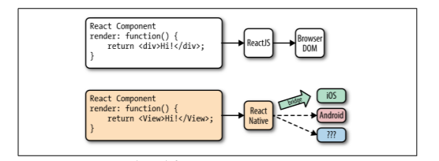

# React-Native

## Was ist React-Native?

Mit React-Native lassen sich Android- und iOS-Applikationen mit nur einem Code realisieren. Diese Applikationen
wirken sehr nativ, obwohl die mit Javascript geschrieben wurden sind. React-Native ist ein Javascript Framework 
und wurde von Facebook entwickelt. Als Basis dient React, welches eine Javascript Bibliothek ist und auch von 
Facebook entwickelt wurde. Deshalb sind sich auch React und React-Native sehr ähnlich. Wie auch in React, ist 
JSX in React-Native verfügbar. Des weiteren ist es möglich über Javascript-Schnittstellen, die von React-Native 
bereitgestellt werden, auf die API, der jeweiligen Plattform zu zugreifen. Dadurch ist es beispielsweise möglich,
auf die Kamera zu zugreifen.

## JSX

JSX ist eine Javascript Erweiterung. XML wird genutzt, um Daten intern zu strukturieren und sinnvoll anzuordnen.
Dabei werden von JSX die HTML-Dateien in die Javascript-Dateien eingebettet. Sprich mit JSX ist es möglich Auszeichnungssprachen
in Javascripte zu nutzen. 


## Wie funktioniert React-Native ?



React-Native funktioniert ähnlich wie React mit dem Browser DOM. Statt einen Browser Dom zu rendern nutzt React-Native die API, der jeweiligen Plattform, um die Komponenten zu rendern. Eine React-Natve View wird dann beispielsweise über die jeweilige "Bridge" zu UIView in iOS. Es ist möglich weitere "Bridges" zu entwickeln, um mit React Native für weitere Plattformen zu entwickeln. So gibt es eine React-Native Version, mit der es möglich ist eine Desktopandwendung für Windows und Ubuntu zu entwickeln.     

## Props 

Mithilfe von Props kurzform für Properties werden die Komponeten mit Daten befüllt. Komponenten können verschachtelt sein. So kann eine Komponente Kinder haben oder ist selbst ein Kind sein. Die Elternkomponenten setzen die Props der jeweiligen Komponenten. Props sollten selbst für die eignene Komponente unveränderlich. //Todo warum sollten props unveränderlich sein für die eigne Komponente? 
Die UI-Komponenten werden basierend  nach den States und Props gerendert. Die Komponenten können über die Props von außerhalb gesteuert werden.

### PropTypes

PropTypes ist ein Package, dass genutzt werden kann um während der Laufzeit zu Prüfen, ob eine Property mit dem richtig Typ gesetzt wurde.
Beispiel:
```
name: PropTypes.string.isRequired
```
Die Property name ist vom Typ String und muss gesetzt sein.

Zudem kann eine Property mehrere propTypes haben. Dies mit **oneOfType möglich.

```
name: PropTypes.oneOfType ( [
    PropTypes.string,
    PropTypes.object
] )
```
Mit defaultProp ist es möglich Defaultwerte zu setzen für Properties. Diese werden übernommen, wenn die Properties nicht gesetzt werden.

```
myComponent.defaultProps = {
    name : 'Simon'
}

```

## States

Innerhalb der Komponenten werde diese mithilfe der States gesteuert.  Dies geschieht durch die Methode setState, die entweder ein Key-Value-Objekt annimmt oder eine Funktion, die ein Key-Value-Objekt zurückgibt. SetState löst das Rerendern der Komponente sowie der Kinderkomponenten aus. Die Zustande sollten im Konstruktor initialisiert.

## Styles

Zum Stylen der Komponeten wird jeglich JavaScript benötigt. Die Styles werden in der Property Style gesetzt. Die Style Property ist im Besitz jeder Komponente. Die Style-Namen und Werte entsprechen die in CSS mit ein paar Ausnahmen. In React Native werden die Style-Namen nach der Camel Case Konvention geschrieben. 

Die Styles können in derselben Zeile gesetzt wie die Komponete, die gestyled werden soll.
```
<Text style={{color:'red'}}>Red text</Text>
```
Mit StyleSheet.create ist es möglich ein "Style"-Objekt zu definieren, dass von verschiedenen Komponenten verwendet werden kann.

Die Styles können bedingt gestetzt werden.

```
<View style={[(this.props.isTrue) ? styles.bgcolorBlack : styles.bgColorWhite]}>
```
//Todo Array mit Styles

## Layouting

Das Arrangieren der Komponenten in React Native wird durch Flexbox ermöglicht. Flexbox ist ein CSS3 Layout-Module. Mit Flexbox ist ein konsistentes Layout bei verschiedenen Displayauflösungen möglich. 

Flexbox funktioniert in React Native wie in CSS im Web, mit abgesehen von ein paar Ausnahmen. Zu diese Ausnahmen gehört unteranderem, dass der Default-Wert der Property flexDirection column ist und der Parameter flex nur Zahlen annimmt.


Beim Arbeiten mit Flexbox kann man sich zwei Achsen vorstellen. Die Hauptachse und die Querachse. Die Hauptachse wird definiert durch die Property flex-direction.

Flex-direction kann folgende Werte annehmen:

* row	 
  * Die Komponenten werden horizontal von links nach rechts angeordnet.
* row-reverse
  * Die Komponenten werden horizontal von rechts nach links angeordnet.
* column
  * Die Komponenten werden vertikal von oben nach unten angeordnet.
* Coulmn-reverse
  * Die Komponenten werden vertikal von unten nach oben angeordnet.

[ToDo:Bild zu Flex-direction Hauptachse]

Der Verlauf der Querachse ist abhängig von der Hauptachse. Wenn die Hauptachse entlang der Zeile ausgerichtet ist, dann verläuft die Querachse entlang der Spalte. Verläuft die Hauptachse entlang der Spalte, dann verläuft die Querachse entlang der Spalte Dieses Wissen ist nützlich, wenn man sich mit der Ausrichtung des Inhalts beschäftigt.

[ToDo:Bild zu Flex-direction Querachse]

Die Flex-Property gibt an, wie sich die Komponenten in Bezug auf ihrer Größe verhalten sollen.  Ist der Wert von Flex positiv, so wir die Komponente um das Vielfache größer, sofern so viel Platz im Flex-Container frei ist. Der Flex-Container ist der Bereich, in dem Flexbox genutzt wird.  Die Komponente ist dann bezüglich ihrer Größe flexible. Ist der Wert der Property gleich 0, so bleibt die Komponente bei ihrer festen Größe. Sie ist dann nicht flexibel. Bei -1 wird die Komponente auf ihre minWidth und minHeight Werte geschrumpft, sofern nicht genügend Platz gibt im Flex-Container.

[ToDo: Bilder zur Flex-Property]

## Touch and Gesture

## Navigation/Routing

## PushNotification

## HTTP-Request

## Components

## Listen

## Tabellen

## Animations

## Unit-Test

## Native Code

## Debugging Tools

## Develeopment Tools

## Statemanagement

## Datenbank/Persistenter Speicher
