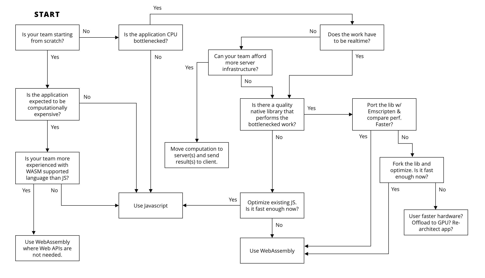
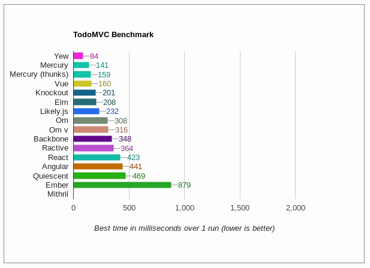
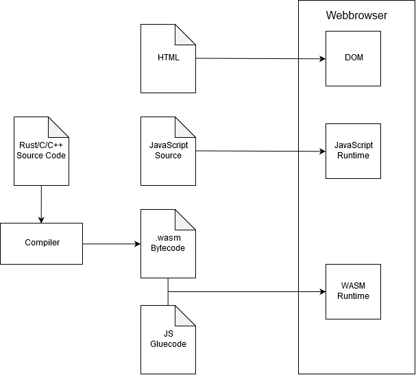

# Rust und Yew

## Was ist Rust?
[Rust](https://www.rust-lang.org/) ist eine Multiparadigmen-Programmiersprache (generisch, nebenläufig, funktional, imperativ, strukturiert), mit dem Ziel der Fehlervermeidung zur Kompilierzeit mithilfe von z.B. kontrollierten Speicherzugriffen.

## Was ist Yew?
[Yew](https://github.com/DenisKolodin/yew) ist ein in Rust geschriebens Framework für die Erstellung von Frontend Apps mit WebAssembly. Das Framework unterstützt multi-threading sowie Nebenläufigkeit und benutzt die Web Workers API zur Erstellung von agents in seperaten Threads.

## Grundlagen Rust

<details>
    <summary> Grundlagen und sprachspezifische Eigenschaften von Rust (basierend auf https://doc.rust-lang.org/book) </summary>

### Installation, Updates, Deinstallation

#### Linux und MacOS
Um Rust auf Linux oder MacOS zu Installieren braucht man nur `curl`. Mit ``` curl https://sh.rustup.rs -sSf | sh``` wird der Download und die Installation gestartet. Rust wird automatisch zu den Umgebungsvariablen hinzugefügt.

#### Windows
Man benötigt für die Installation die [Installationsdatei](https://www.rust-lang.org/tools/install) sowie [Build Tools for Visual Studio 2017](https://www.visualstudio.com/downloads/#build-tools-for-visual-studio-2017). Wenn man beides hat muss man nur der Rust Installation folgen.

#### Updates und Deinstallation
Updates können mit dem Befehl `rustup update` installiert werden. Die Deinstallation kann mit dem Befehl `rustup self uninstall` durchgeführt werden.

### Grundliegende Konzepte der Sprache

#### Coding Convention

#### Datentypen

Grundlegend hat Rust zwei Arten von Datentypen:

Skalar Typen:
* Integer
* Float
* Boolean
* Character

und
Verbindungstypen:
* Tupel
* Array

##### Tupel Nutzung

Ein Tupel kann folgend deklariert werden.
```
let Name: (Typ, Typ, Typ, ...) = (Wert, Wert, Wert, ...)
```
Es gibt zwei Möglichkeiten an die Werte eines Tupels ranzukommen.
1. Dot notation
```Rust
let tup: (i8, i8) = (1, 2);
let eins = tup.0;
let zwei = tup.1;
```
2. destructure
```Rust
let tup: (i8, i8) = (1, 2);
let (x, y) = tup;
```

##### Array Nutzung

Ein Array kann folgend deklariert werden.
```Rust
let arr = [1, 2, 3, 4, 5];
let arr2 [i8; 5] = [1, 2, 3, 4, 5];
let arr3 = [3; 5] // [3, 3, 3, 3, 3]
```

Werte eines Arrays können indiziet werden:
```Rust
let a = [1, 2, 3];
let b = a[1]; // b = 2
```

Liegz der Index außerhab des Arraybereichs wird eine Exception geworfen (In Rust auch panic! genannt).

#### Variablen

##### Deklaration
In Rust werden Variablen mit ```let Name: Typ = Wert``` deklariert und initialisiert. Rust unterstützt typinferenz, somit wird oft `: Typ` nicht bei der deklaration gebraucht. Eine Variable ist immer einem Typen zugeordnet, also kann man nicht ein Integer deklarieren und folgden dem ein String zuweisen.

##### Mutability
Alle Variablen sind zunächst immutable, also nicht änderbar nach der ersten initialisierung. Um dies zu umgehen gibt es das Kennwort `mut`, welches die Variablen mutable machen z.B.:
- Falsch:
```Rust
fn main() {
    let x = 5;
    println!("The value of x is: {}", x);
    x = 6;
    println!("The value of x is: {}", x);
}
```
Fehlermeldung:
```
error[E0384]: cannot assign twice to immutable variable `x`
```
- Richtig:
```Rust
fn main() {
    let mut x = 5;
    println!("The value of x is: {}", x);
    x = 6;
    println!("The value of x is: {}", x);
}
```

##### Konstanten
Konstanten in Rust werden mit dem Kennwort `const` gekennzeichnet anstatt mit `let`. Konstanten sind immer immutable. Zudem können Konstanten in jedem scope (auch global scope) deklariert werden und können nur konstante Ausdrücke annehmen und z.B. nicht den Rückgabewert einer Funktion. Außerdem sind Konstanten in ihrem scope valide solange das Programm läuft.

##### Shadowing

In Rust ist es möglich eine Variable mehrmals zu deklarieren, sodass die alte Variable "überschrieben" wird. Somit ist die folgende Implementierung valide:
```Rust
fn main() {
    let x = 5;
    let x = x + 1;
    let x = x * 2;

    println!("The value of x is: {}", x); // The value of x is 12
}
```
Dies ist hilfreich wenn man den Typen einer Variable ändern möchte z.B. braucht man eine Variable aus einem struct, also kann man das struct in eine variable laden und kurz darauf die selbe Variable mit hilfe von `shadowing` überschreiben und den Wert der gebrauchten Variable des structs speichern.

#### Funktionen
Der Funktionskopf in Rust sieht im Vergleich zu anderen Sprachen etwas Anders aus:
```Rust
fn Name(param_name: Typ) -> Rückgabetyp {

}
```
Wenn die Funktion kein Rückgabewert hat wird `-> Rückgabetyp` weggelassen. Zudem wird in Rust kein `return` o.Ä. gebraucht, da der letzte wert im Ausdruck als Rückgabewert gesehen wird:
```Rust
fn five() -> i32 {
  5
}
```
Rückgabewerte in Ausdrücken werden nicht von einem `;` beendet, somit wäre folgendes falsch:
```Rust
fn five() -> i32 {
  5;
}
```
Fehlermeldung:
```
error[E0308]: mismatched types
 --> src/main.rs:7:28
  |
7 |   fn plus_one(x: i32) -> i32 {
  |  ____________________________^
8 | |     x + 1;
  | |          - help: consider removing this semicolon
9 | | }
  | |_^ expected i32, found ()
  |
  = note: expected type `i32`
             found type `()`
```
Fehlt der Ausdruck wird ein leerer Tupel zurückgegeben und wird auch `statement` anstatt `expression` genannt

Ausdrücke können auch mitten in einer Funktion vorkommen z.B.:
```Rust
fn something() {
  let i = { // anfang Ausdruck
    5
  }; // ende Ausdruck
  println!("value: {}", i); // value: 5
}
```

##### Macros sind keine Funktionen
Macros wie z.B. `println!()` werden mit einem `!` gekennzeichnet und sind nicht Funktionen. Genaueres zu Macros wird später geschrieben.

#### Kommentare
Kommentare werden nur mit `//` gekennzeichnet und können überall im Code stehen. Alles folgende nach `//` wird als Kommentar gesehen und nicht als Programmcode.

#### Kontrollfluss

##### If-Ausdrücke
If-Ausdrücke werten einen bool aus und führt dann einen der Zweige (auch `arms` genannt) aus.
```Rust
let num = 3;
if num < 5 {
  println!("condition true");
} else {
  println!("condition false");
}

Ausgabe: condition true
```
Ist der auszuwertende Wert kein bool wird ein Fehler zur Kompilierzeit erkannt, da Rust nicht versucht den Wert in ein bool zu casten sondern in erster Linie nur bools akzeptiert.
Es können mehrere Konditionen mit `else if` kombiniert werden, es wird aber nur der erstzutreffende Arm ausgeführt:
```Rust
let number = 6;
if number % 4 == 0 {
    println!("number is divisible by 4");
} else if number % 3 == 0 {
    println!("number is divisible by 3");
} else if number % 2 == 0 {
    println!("number is divisible by 2");
} else {
    println!("number is not divisible by 4, 3, or 2");
}

Ausgabe: number is divisible by 3
```

Man kann If-Ausdrücke auch mit `let` kombinieren, solange die erwarteten Rückgabewerte den selben Typen besitzen:
```Rust
let condition = true;
let number = if condition {
    5
} else {
    6
};

println!("The value of number is: {}", number);

Ausgabe: The value of number is: 5


let condition = true;
let number = if condition {
    5
} else {
    "six"
};

Fehler: error[E0308]: if and else have incompatible types
note: expected type `{integer}`
             found type `&str`
```

##### Schleifen

###### loop
`loop` ist eine Endlosschleife, aus der nur mit `break` rauskommt.
```Rust
loop {
    counter += 1;

    if counter == 10 {
        break;
    }
};
```

`loop` kann man auch wieder mit `let` verbinden:
```Rust
let result = loop {
    counter += 1;

    if counter == 10 {
        break counter * 2;
    }
};
```

###### while
`while` wird so lange ausgeführt bis die gegebene Kondition `false` ist.
```Rust
let mut number = 3;

while number != 0 {
    println!("{}!", number);

    number = number - 1;
}
```

###### for
Für den durchlauf z.B. eines Arrays ist nutzung von `while`-Schleifen riskant und es wird eine `for`-Schleife bevorzugt. sie ermöglicht es Entweder durch ein Array o.Ä. oder durch eine `range` von Zahlen zu iterieren.
```Rust
let a = [10, 20, 30, 40, 50];

for element in a.iter() {
    println!("the value is: {}", element);
}

for n in 0..101 { // von 0 bis 100
  //code
}
```

### Cargo als Paketmanager

#### Crates

Mit Cargo erstelle Projekte werden `crates` genannt, egal ob es sich um ein Binärprogramm oder eine Bibliothek handelt. Es gibt eine öffentliche Liste von anerkannten Crates die man auf [Crates.io](https://crates.io/) finden kann. 
Erstellt man so ein Projekt werden zwei Dateien und ein Ordner erstellt:
* `src` Ordner mit der Datei `main.rs` (Binärprogramm) oder `lib.rs` (Bibliothek)
* `Cargo.toml`

`main.rs` und `lib.rs` werden als Einstiegspunkt des Programms gesehen und `Cargo.toml` bezeichnet man als Manifest,das alle Metainformationen beinhaltet, die das Programm zum kompilieren benötigt. Diese Datei ist vergleichbar zu `package.json`, welches man aus `Node.js` kennt. Die meist Benutzten Metadaten für Cargo Projekte sind: 
* package
    * beinhaltet Name, Version, Author(en) und Edition (Benutzte Rustversion zum Kompilieren)
* dependencies
    * beinhaltet Informationen von benutzten Paketen und deren Version

Pakete die in den `dependencies` genannt sind werden beim Kompilieren als source runtergeladen und mit kompiliert, d.h. dass es nicht zu Fehlern kommt, weil eine Library für das falsche System kompiliert wurde.
Bei oder nach dem Kompilieren wird auch eine `Cargo.lock` Datei erstellt, die Informationen über benutzte Pakete beinhaltet.
Jedes Paket in der Datei ist folgend aufgebaut:

``` 
[[package]]
name = "name" # Name des Pakets
verson = "1.0.0" # Versionsnummer
source = "source+link" # Für Crates in Crates.io "registry+https://github.com/rust-lang/crates.io-index" sonst z.B. "git+https://github.com/some/project"
dependencies = {
    "name version (source)", # z.B. "stdweb 0.4.16 (registry+https://github.com/rust-lang/crates.io-index)",
}
```

Zudem stehen zum Schluss alle Checksums der benutzten Pakete, passend zu ihrer Version. Für Pakete die nicht in Crates.io zu finden sind, ist es möglich, dass keine Checksum vorhanden ist.

#### .toml

Die Dateiendung `.toml`steht für "Tom's Obvious Minimal Language" und wird im Rustkontext als Datenformat für die Manifestinformationen benutzt. Der Aufbau einer .toml-Datei ist .json relativ ähnlich, doch sie unterscheiden sich stark in der Syntax.

##### Key-Value-Paare

Geabreitet wird weiterhin noch mit Key-Value-Paaren. Bei den Keys ist zu beachten, dass es `Bare` und `Quoted` Keys gibt. Bei den Bare Keys darf man nur ASCII Buchstaben, Zahlen, Unter- und Bindestriche benutzen (A-Za-z0-9_-), wobei man bei den Quoted Keys (mit `"` gekennzeichnet) eine größere Auswahl hat. Als Best-Practice soll man dennoch nur Bare Keys und Quoted nur in Notfällen benutzten. 
Als Values sind folgende Typen erlaubt:
* String
* Integer
* Float
* Boolean
* Offset Date-Time
* Local Date-Time
* Local Date
* Local Time
* Array

Wenn man ein Datum benutzt, muss dieser [RFC 3339](https://tools.ietf.org/html/rfc3339) konform sein. Arrays werden mit eckigen Klammern dargestellt und die Elemente werden mit einem Komma getrennt. Ebenfalls können Arrays weitere Arrays beinhalten.


##### Tables
Tables, bzw. auch hash tables und dictionaries genannt, werden hier als Kollektion von Key-Value-Paaren benutzt. Sie werden mit eckigen Klammern mit einem Namen gekennzeichnet (`[table]`) und sammelt alle Paare die danach Folgen. 


Ein [Beispiel](https://github.com/toml-lang/toml/blob/master/README.md#user-content-example) für eine .toml-Datei wäre:
```
# This is a TOML document.

title = "TOML Example"

[owner]
name = "Tom Preston-Werner"
dob = 1979-05-27T07:32:00-08:00 # First class dates

[database]
server = "192.168.1.1"
ports = [ 8001, 8001, 8002 ]
connection_max = 5000
enabled = true

[servers]

  # Indentation (tabs and/or spaces) is allowed but not required
  [servers.alpha]
  ip = "10.0.0.1"
  dc = "eqdc10"

  [servers.beta]
  ip = "10.0.0.2"
  dc = "eqdc10"

[clients]
data = [ ["gamma", "delta"], [1, 2] ]

# Line breaks are OK when inside arrays
hosts = [
  "alpha",
  "omega"
]
```
</details>

## Grundlagen Yew
<details>
    <summary> Das Aufbauen einer Webseite mit Hilfe von WebAssembly und Yew in Rust </summary>

### MVC mit Yew

Der grundlegende Aufbau für eine Webseite mit Wasm und einem MVC Ansatz ist, dass man ein `struct Model` Implementiert, indem Services (FetchService, ConsoleService, LocalStorageService) oder reguläre Variablen definiert werden. Um diese zu Initialisieren muss man ein `Component` für das `Model` Implementieren, welches die Methoden `create` und `update` beinhalten muss. 

#### Deklaration Model

In dem Beispiel, dass sich in den Beispielen von Yew [hier](https://github.com/DenisKolodin/yew/tree/master/examples/counter) befindet, benötigt das `Model` die Konsole (`console: ConsoleService`) und eine Variable, die fürs Zählen benutzt wird (`value :i64`). Die `Model` Deklaration sieht folgend so aus:
```Rust
pub struct Model {
    console: ConsoleService,
    value: i64,
}
```

#### Component für Model

Das `Component` beinhaltet vier sachen:
* Alias für `Message`
* Alias für `Properties`
* Methode `create`
* Methode `update`

```Rust
impl Component for Model {
    // impl
    type Message = Msg;
    type Properties = ();
    fn create (_: Self::Properties, _: ComponentLink<Self>) -> Self {
        Model {
            // Variablen Initialisierung
        }
    }

    fn update(&mut self, msg: Self::Message) -> ShouldRender {
        match msg {
            // Pattern Matching
        }
    }
}
```

##### Methode: `create`

In der Methode wird alles Initialisiert, was für das `Model` gebraucht wird. Es kann Informationen beinhalten wie:
* Datenbank verbindungen
* laden einer `JSON` Datei
* Initialisierung des `LocalStorage`
* Erzeugung des `ConsoleService`

Im gegebenen Beispiel wird nur die Konsole und eine Zählvariable gebraucht und der Inhalt der Methode sieht folgend aus:
```Rust
    Model {
        console: ConsoleService::new(),
        value: 0,
    }
```

##### Methode: `update` 

Um die Webseite zu verändern, wird die Methode `update` implementiert, die eine `Message` durch pattern matching auswertet und folgend das Passende Ausführt. Das Beispiel beinhaltet drei Buttons, die jeweils die Zählvariable verändert (Hoch-, Runterzählen und zwei mal Hochzählen). 

```Rust
match msg {
    Msg::Increment => {
        self.value = self.value + 1;
        self.console.log("plus one");
    }
    Msg::Decrement => {
        self.value = self.value - 1;
        self.console.log("minus one");
    }
    Msg::Bulk(list) => for msg in list {
        self.update(msg);
        self.console.log("Bulk action");
    },
}
```

Dabei fallen zwei interessante Sachen auf:
* Rekursiver Aufruf des Updates ist möglich
* man kann den `Message`s listen übergeben.

Zuletzt braucht die Methode noch den Rückgabewert `true` damit bekannt ist, dass das Update erfolgreich war.

#### Rendern der Website

Bisher wurde nicht erklärt wie man `HTML` in die Webseite einbindet und da kommt das `Renderable` ins Spiel, denn dort wird die 'view' für die Webseite implementiert. In der Methode kann man mit einem Makro JSX ähnlich `HTML` code schreiben. Ebenfalls ist es ermöglicht, Rust Funktionen, Makros, Variablen, etc. innerhalb der `HTML` definition aufzurufen.

```Rust
impl Renderable<Model> for Model {
    fn view(&self) -> Html<Self> {
        html! {
            <div>
                <nav class="menu",>
                    <button onclick=|_| Msg::Increment,>{ "Increment" }</button>
                    <button onclick=|_| Msg::Decrement,>{ "Decrement" }</button>
                    <button onclick=|_| Msg::Bulk(vec![Msg::Increment, Msg::Increment]),>{ "Increment Twice" }</button>
                </nav>
                <p>{ self.value }</p>
                <p>{ Date::new().to_string() }</p>
            </div>
        }
    }
}
```

Hier kann man auch sehen, wie für `Message::Bulk()` ein `vector` erstellt wird, welches weitere `Message`s beinhaltet.

</details>

## Warum soll man Wasm benutzen?

### Nicht nur JavaScript

Bis etwa Ende 2017 war die einzige Möglichkeit des Programmierens auf der Clientseite im Web nur mit JavaScript möglich. Wasm ermöglicht es eine Systemprogrammiersprache, wie C/C++ oder Rust, in einem Assembely-ähnlichem Datenformat zu Kompilieren, welches dann vom Browser ausgefürht werden kann. Wasm soll aber nicht als Ersatz für JS gesehen werden, sondern als erweiterung für Use-Cases die von den Vorteilen von Wasm profitieren.



### Schnelligkeit

Da Wasm Dateiformat binär ist, lädt und fürht der Browser die Dekodierung der Datei schneller aus als das Parsen einer JavaScript-Datei. Die Kompilierung kann in Fällen schneller als die Just-In-Time Kompilierung der JavaScript-Datei sein und muss nicht nachträglich in der Laufzeit optimiert werden, da dies schon bei der Generierung der Datei passiert. Generell wird die Ausführung von Wasm 20x schneller als JS gesehen und nur 20% langsamer als die Ausführung von nativem Code



### Übertragbarkeit

Ein wichtiger Punkt bei dem Design von WebAssembly war es, dass die Software auf jedem Endgerät läuft, egal welcher Prozessor oder Betriebssystem auf dem Gerät läuft. Somit kann die Software auf x86, x64 und ARM sowie auf MacOS, Windows und linuxbasierten Systemen ausgeführt werden.

## Wasm Workflow

Wasm wird generell als Zusatz zu einer bestehenden Webandwendung gesehen und somit kann dann zum Beispiel eine Webseite ein Spiel einbinden, das in Wasm umgewandelt wurde, aber der Rest kann HTML und JS sein.



### Unterscheid zu yew.rs

Yew ermöglicht es einem die ganze Webseite in Rust zu erstellen, sodass die `index.html` als Einstiegspunkt dient aber der Inhalt folgend durch die Wasm-Datei gefüllt wird. Zudem wird leicht ermöglicht externe JavaScript Funktionen einzubinden und auszuführen

