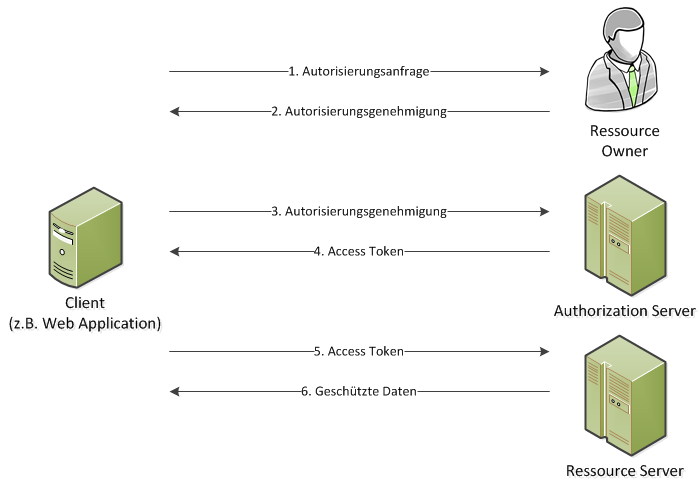

# Sicherheit und Authentifizierung 

## Authentifizierung

Identitäten lassen sich im Netz nur schwer beweisen und die meisten Websites oder Dienste verwenden unterschiedliche Techniken der Authentifizierung.

Meistens kann man die Identität einer Person über drei Faktoren bestimmen: 

* Wissensfaktor - Eine Information 
  * Dazu gehört das Passwort und auch eine geheime Fragestellung wie "Wie ist der Geburtsname deiner Mutter?" 
* Eigentums- bzw. Besitzfaktor - Ein Gegenstand
  * Führerschein, Personalausweis, EC-Karte, E-Mail-Adressen, Telefonnummern oder temporäre Schlüssel-Codes die über SMS-Tans, Sprachanrufe oder E-Mails versendet werden.
* Inhärenz- bzw. Existenzfaktor - Ein Merkmal
  * Fingerabdruck über den Sensor am Handy oder Laptop, Iris-Scanner

Diese Ein-Faktor-Authentifizierung reicht aber nicht mehr aus, da die meisten Dienste lediglich Username und Passwort gebrauchen.

### Zwei-Faktor-Authentifizierung

Wenn die Login-Daten herausgegeben wurden, fehlt dem Daten-Dieb immer noch ein einzigartiger Faktor zur Identifizierung.

Zu diesen zwei Faktoren zählt zum einen eine Kombination aus zwei der oben genannten Faktoren. Es werden aber noch einige andere Faktoren getestet und entwickelt. 

* Standortfaktor
  * Loggt sich ein Benutzer außerhalb seiner gewohnten Umgebung oder IP-Adresse ein, muss er einen zusätzlichen Schlüsselcode eingeben. 
* Verhaltensbasierende Faktoren
  * Surfverhalten, Stimme, Bewegung mit der Maus oder auf dem Touchscreen.

Am häufigsten werden aber Passcodes auf Mobilgeräte wie Smartphone und Mobiltelefon gesendet. Dieser Code ist nur einmal gültig und wird per E-Mail, SMS oder über eine entsprechende App versendet.

### Apps

* Google Authenticator
* Authy
* Microsoft Authenticator

## OAuth

OAuth ist ein offenes Protokoll, das API-Autorisierung für Desktop- Web- und Mobile-Anwendungen ermöglicht. Der Benutzer kann mithilfe des Protokolls einer Anwendung (Client oder Third-Party) den Zugriff auf seine Daten erlauben. Dabei wird das weitergeben der Passwörter an Dritte vermieden. 

### Token

OAuth verwendet Tokens zur Autorisierung eines Zugriffs auf geschützte Ressourcen.

* **Access-Token**
  * Um auf die Daten auf dem Ressource Server zu greifen zu können muss ein Access-Token vom Client übermittelt werden. Der Client kann die gewünschte Berechtigung beim Authorization Server anfragen und der Server teilt die gewährten Berechtigungen dem Client daraufhin mit. Der Access-Token ist nur für eine begrenzte Zeit gültig.
* **Refresh-Token**
  * Wenn ein Access-Token abgelaufen oder ungültig geworden ist kann man mit dem Refresh-Token einen neuen Access-Token beim Authorization Server anfragen. Dieser Token hat ebenfalls eine zeitliche Begrenzung. Der Token wird genau wie der Access-Token nach der Autorisierung an den Client gesendet. Da der Refresh-Token bereits die Autorisierung des Ressource Owners repräsentiert, muss für eine Neuanfrage keine weitere Autorisierung eingeholt werden. Damit wird die Lebenszeit der Access-Token auf wenige Minuten minimiert und somit die Sicherheit des Protokolls erhöht.

### Protokollfluss

1. Client fordert Autorisierung vom Ressource Owner an. Wird bevorzugt über einen Authorization Server durchgeführt.
2. Client enthält eine Autorisierungsgenehmigung. Dies erfolgt über eine von vier Autorisierungsgenehmigungen.
   1. Authorization Code
   2. Implicit 
   3. Ressource Owner Password Credentials 
   4. Client Credentials 
3. Client fordert Access-Token und nutzt dabei die Genehmigung aus Schritt 2.
4. Der Authorization Server authentisiert den Client und Prüft Genehmigung. Wenn dies erfolgreich ist wird der Access-Token versendet.
5. Der Client fragt die geschützten Daten vom Ressource Server an.
6. Ressource Server prüft den Access-Token und sendet, wenn gültig, die gewünschten Daten.

## Quellen

* https://www.welivesecurity.com/deutsch/2016/05/04/grundlagen-der-authentifizierung/
* https://de.wikipedia.org/wiki/Zwei-Faktor-Authentisierung
* https://de.wikipedia.org/wiki/OAuth