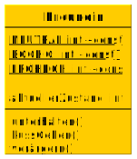
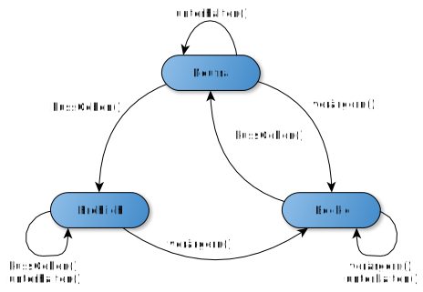

# Einleitung

## Was ist "State Managment"?

State Managment umfasst die Verwaltung von verschiedenen Zuständen eines Objektes innnerhalb dieses Objektes. 


## Beispiel

In den Themen zur grundlegenden Erklärung werde ich mich vor allem auf ein Beispiel beziehen, nämlich die Zustände einer Freundin. Die Zustände der Freundin sind ihre momentane Stimmungslage, sie kann also zum Beispiel fröhlich, traurig, verärgert und so weiter sein. Die Zustände wechselt man durch verschiedene Handlungen, z.B unterhalten oder ärgern.

# Grundlagen

## Definitionen

### State / Zustand

Definiert auf Deutsch einen Zustand. Bezogen auf unser Beispiel gibt dieser an, wie die Freundin sich gerade fühlt. Würde man das jetzt auf einen Onlineshop beziehen, wären mögliche Zustände zum Beispiel ob man Premiumkunde ist oder nicht.  In vielen Programmiersprachen ist der Zustand eines Objektes auch als die Menge und Werte seiner Attribute definiert. 

Für unser Beispiel wäre deshalb folgendes Klassendiagramm denkbar:




## Zustandsidagramm

Aus diesem Klassendiagramm kann man jetzt ein Zustandsdiagramm entwickeln.



Wie man sieht sind hier 3 verschiedene Zustände vorhanden: Neutral, Fröhlich und Bockig. Um diese Zustände zu erreichen kann man verschiedene Aktionen ausführen. So wechselt man von dem Zustand Neutral in den Zustand Bockig, in dem man die Freundin ärgert.

Es sind also alle Zustände aufgeführt und die entsprechenden Aktionen um die Zustände zu erreichen.

Diese Diagrammform kennen wir bereits aus der theoretischen Informatik. Auch die Automatentheorie zeigt letztendlich nur verschiedene Zustände und ihre Übergänge an.

## Historie

Wie hat man das früher gelöst? In den 1970er Jahren war strukturierte Programmierung der Maßstab und man hatte noch keine Verhaltensmuster. Man hätte für diesen Fall jedem Zustand einen Integer zugeteilt (Fröhlich = 0, Neutral =1, Bockig = 2) und hätte anschließend verschiedene Fallunterscheidungen ausgeführt. In Pseudocode würde das für die Methode verärgern() ungefähr so aussehen:

```java
switch aktuellerZustand:
// Zustandsabhängiges Verhalten
case FRÖHLICH:
// Verhalten wenn Fröhlich
​	aktuellerZustand = BOCKIG;

case NEUTRAL:
// Verhalten wenn Neutral
​	aktuellerZustand = BOCKIG;

case BOCKIG: 
// Verhalten wenn Bockig
​	aktuellerZustand = BOCKIG;
```

Wir können uns jetzt ohne Probleme vorstellen, dass diese Art der Lösung sehr unübersichtlich wird, wenn man mehrere Zustände hat. Häufig kommen dann auch noch weitere Verschachtelungen dazu, wirklich handelbar ist das Ganze also nicht mehr. Auch die Wartbarkeit leidet stark unter diesem Entwurf. Hat die Freundin jetzt noch einen weiteren Zustand, so müsste jede Methode einzeln angepasst werden. Dies ist viel zu aufwändig und wahrscheinlich würde man welche vergessen.

# Quellen

<https://de.wikipedia.org/wiki/Zustand_(Entwurfsmuster)#Beispiele>


<https://www.philipphauer.de/study/se/design-pattern/state.php>


<https://blogs.itemis.com/de/modellieren-mit-zustandsautomaten-teil-5-das-state-pattern>


<https://de.wikipedia.org/wiki/Zustand_(Entwurfsmuster)>


Theoretische Grundlagen der Informatik, Ralf Socher, ISBN 978-3-446-41260-6


Der C++-Programmierer, Ulrich, Breyman, ISBN 978-3-446-44346-4


