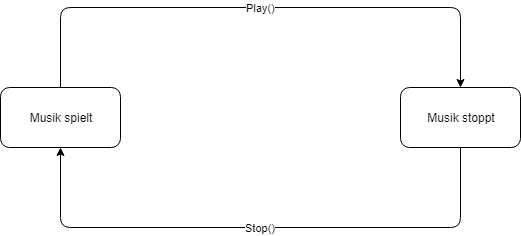
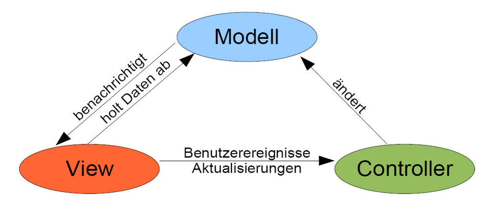
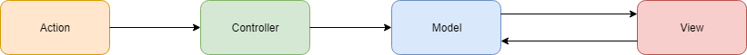
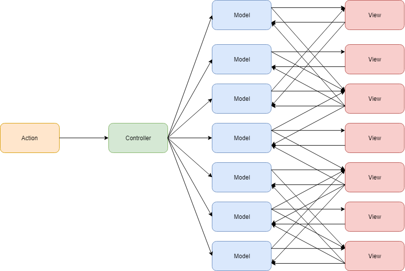
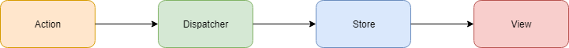

# Einleitung

## Was ist "State Managment"?

State Managment umfasst die Verwaltung von verschiedenen Zuständen eines Objektes innerhalb dieses Objektes. 

## Wo finde ich State Managment?

State Managment finden wir in fast allen modernen Softwaresystemen. Dabei ist es egal, ob wir gerade ein soziales Netzwerk bedienen, welches uns immer die aktuelle Anzahl ungelesener Nachrichten mitteilt, oder einen Online Shop, wo wir immer wissen wollen, wie viele Waren gerade im Einkaufswagen abgelegt sind. Aber auch Desktop Apps nutzen State Managment. So wäre es Spotify zum Beispiel schwierig, immer das aktuelle Lied, welches gerade abgespielt wird, auf jeder Unterseite anzuzeigen.

## Gründe für State Managment

Der größte Grund für State Managment ist die Verbesserung des Usererlebnisses. Nehmen wir als Beispiel die Spotify App. 


In dem unteren Bereich sieht man welches Lied momentan gespielt wird. Dazu werden noch Zusatzinformationen eingeblendet wie der Name des Künstlers und das Musikalbum. Rechts sieht man eine Fortschrittsleiste für das Lied und noch weiter rechts, in diesem Bildausschnitt nicht vorhanden, sind auch die üblichen Steuerungsbutton zum Abspielen von Musik. In dem oberen, dunkleren Bereich sehe ich die Komponente, die ich gerade geöffnet habe. In diesem Beispiel handelt es sich um die verschiedenen Titel in einer Playlist.

Während der obere Bereich immer wechselt, je nachdem welche Komponente gerade geöffnet wurde, bleibt der untere an sich immer gleich. 

Doch was sind die Effekte in diesem Beispiel von Schlechtem oder gar keinem State Managment? Der Aufbau der App würde sich nicht zwingend verändern. Aber das Benutzererlebnis könnte sich signifikant verschlechtern. Man könnte sich zum Beispiel vorstellen, dass nicht mehr immer der aktuelle Titel angezeigt wird, sondern vielleicht teilweise ein bereits gespielter. Der User würde bei solchen Nachteilen schnell genervt sein und womöglich sogar auf ein Konkurrenzprodukt umsteigen.

Entstehen könnten solche Fehler durch eine inkonsistente Behandlung der Zustandswerte. Wenn zwei verschiedene Komponenten auf unterschiedliche Daten zugreifen, um das aktuelle Lied zu erfahren, muss gewährleistet werden, dass beide Daten immer aktuell sind. Viel einfacher ist es natürlich, wenn jede Komponente den Zustand zentral erfragen kann. 

Neben der Konsistenz der Zustände in den verschiedenen Komponenten und der damit einhergehende Verbesserung der Nutzbarkeit gibt es auch noch weitere positive Effekte. So ist der Code zum Beispiel wartbarer und besser erweiterbar. Die Pflege der Zustände erfolgt zentral, weshalb ich auch nur an einer Stelle Änderungen oder Erweiterungen pflegen muss. 

# Grundlagen

## Definitionen

### State / Zustand

Wird häufig durch die Gesamtheit der Attribute und ihrer Werte beschrieben. Der Zustand ergibt sich also aus der momentanen Belegung aller Attribute. 

### Zustandsdiagramm

Um die verschiedenen Zustände darzustellen, wird meistens ein Zustandsdiagramm verwendet.



In dem Diagramm sind nur zwei Zustände und deren Übergänge dargestellt. Die beiden Zustände sind, dass entweder die Musik spielt oder stoppt. Ein Wechsel in andere Zustände wird durch die beiden Methoden Play() oder Stop() realisiert.

Hierbei handelt es sich natürlich um ein sehr einfaches Beispiel. Größere Anwendungen werden allerdings viele verschiedene Zustände haben. Die Fälle und Übergänge werden also deutliche komplexer. 

## Flux

### Pattern oder Framework?

Flux ist eine Architektur, also ein Pattern und kein Framework. Das bedeutet, dass nur Flux erst einmal keinen Code liefert, um die Architektur umzusetzen. Stattdessen beschreibt es einen möglichen Aufbau der Software.

### Entstehung

Flux ist eine von Facebook entworfene Architektur zum Programmieren von Client basierten Webseiten. Diese bestehen aus verschiedenen UI-Komponenten, welche natürlich auch einen Zustand haben. Zum Beispiel der Warenkorb in dem Online-Shop. Je nach Inhalt kann dort die Anzeige variieren. Und der Status kann sich natürlich auch durch Aktionen auf der UI verändern.

Es gab bei der Entwicklung nach dem klassischen MVC-Modell verschiedene Probleme. So hat Facebook mit der Entwicklung von React.js ein Framework vorgestellt, dass in der klassischen MVC-Architektur nur den View-Part abbildet. Das Framework ist an sich genommen jedoch eine ideale Lösung, um in einer UI eine Komponentenarchitektur abzubilden. Das große Problem, was durch React.js jedoch bestand war, dass der globale State noch nicht verwaltet worden ist. Facebook ist dabei noch einen Schritt weiter gegangen und hat ein Framework entwickelt, dass nur an einer Stelle diesen State verwaltet. Dadurch können keine Probleme mit Inkonsistenzen auftreten.

### Architektur

### Aufbau


Das obere Diagramm beschreibt den Aufbau und Datenfluss der Architektur. Wie man sieht, fließen die Daten immer von einem Punkt zu einem anderen. Was genau die einzelnen Komponenten sind, wird später noch beschrieben. Aber eine Action kommuniziert immer mit dem Dispatcher, welcher immer mit dem Store redet. Und der Store kommuniziert immer mit der View. Wie man sehen kann, gibt es zwei Actions. Einmal die Action links, welche aus dem Backend ausgelöst wird und einmal die Action ausgehend von der View-Komponente. Diese Action wird also von der UI ausgelöst. 

Es kann mehrere Stores, Views und Actions geben. Dadurch, dass es allerdings nur einen Dispatcher gibt, müssen alle Daten durch diesen Dispatcher fließen. Deshalb wird dieses Modell auch Single-Data-Flow-Modell genannt.

### Action

Eine Action ist ein normales JavaScript-Objekt, welches immer mindestens aus einem "type" besteht. Dadurch kann später der Store erkennen, ob diese Action relevant ist. Weitere Attribute können hinzugefügt werden. Erstellt wird dieses Objekt durch einen Action Creator.

Wie könnte so etwas aussehen? Eine typische Action könnte folgendermaßen aufgebaut sein:

```react
{
    type: ActionTypes.Test,
    name: "test"
 }
```

Der Type wird häufig als String übergeben. In dem oberen Beispiel ist vorher ein Modul ActionTypes definiert worden. Das ist jedoch variabel.

Ein entsprechender ActionCreator könnte dementsprechend folgenden Maßen aussehen:

```react
export function addTest(title){
    return {
        type: ActionTypes.Test,
        name: title
   };
 }
```


### Dispatcher

Der Dispatcher nimmt eine Action entgegen und reicht sie an den passenden Store weiter. Hierzu sind alle Stores bei dem Dispatcher registriert. Die wichtigste Eigenschaft des Dispatchers ist es dabei, dass er immer nur eine Action gleichzeitig verarbeitet. Dies erleichtert das Debugging, da so die Möglichkeit besteht, den Dispatcher anzuhalten, um den Eventfluss zu kontrollieren. 

Ebenfalls kann der Dispatcher auch verschiedene Abhängigkeiten zwischen den Stores managen.

### Stores

Hier wird jetzt die Applikationslogik verwaltet. Sobald eine Action erkannt wurde, kann diese den Store verändern. Der veränderte Store benachrichtigt wiederum seine View-Komponenten, welche sich dadurch neu rendern und so immer aktuell bleiben. Es kann allerdings mehrere Stores geben.

### Views

Diese sind die Komponenten, welche das Frontend beschreiben. Diese hören, ob sich der zugeordnete Store verändert hat und rendern sich anschließend entsprechend neu.

### Frameworks und Bibliotheken

### Redux

Redux ist momentan wohl das am weitesten verbreiteten Framework wenn es um die Flux-Implementierung geht. Grundsätzlich gibt es die Redux-Bibliothek für die meisten aktuellen JavaScript-Frameworks. So sind zum Beispiel React, Angular und Vue kein Problem.

Die Motivation Redux zu entwickeln ist die gleiche wie bei Facebook. Die Verwaltung des State in modernen Webanwendungen über das klassische MVC ist sehr kompliziert.  Doch ist Redux eine Bibliothek, die nicht die Reinform von Flux umsetzt. Die grundlegende Idee bleibt immer noch gleich, nämlich dass aus einer Aktion ein neuer Zustand entsteht. Der Datenfluss ist also immer noch der gleiche. Allerdings gibt es bei Redux keinen Dispatcher. Das liegt einfach daran, dass Redux auf reine Funktionen anstatt von Ereignissemittern setzt. Und Funktionen benötigen keine zentrale Einheit, die sie verwalten.  Diesen Unterschied kann man allerdings auch einfach Implementierungsdetail ansehen. Redux selber sieht das so.

Ein weiterer direkter Unterschied zu Flux ist, dass Redux immer nur in einem Store umgesetzt wird. Auch dies kann man theoretisch als ein Implementierungsdetail ansehen. Dadurch dass es nur einen Store gibt, gibt es bei Redux auch nur eine Quelle für die Daten. Dies ist ein Grundprinzip von Redux.

Ein weiterer Unterschied ist, dass Redux davon ausgeht, dass man seine Daten nie ändert. Redux arbeitet immer mit der Übergabe von neuen Objekten. Dies hat den Vorteil, dass man einfach Objekte und Arrays zur Datenverwaltung einsetzen kann. Auch aus Performancesicht gibt es keinen nennenswerten Nachteil dadurch. Es ist allerdings technisch möglich die Daten zu verändern um spezielle Sonderfälle wie z.B. einen Hot-Reload zu verwirklichen. Es wird jedoch dringendst davon abgeraten.

Desweiteren ist Redux von der funktionalen Programmiersprache Elm beeinflusst worden. Die Architektur dieser Sprache nutzt statische Typisierung und Unveränderlichkeiten. 

Um Asynchronität umzusetzen kann man Redux zusammen mit RxJS verwenden. Darüber ist es möglich, verschiedene Actionsstreams an den Dispatcherpart zu übergeben.

### Alt

Hierbei handelt es sich um eine reine Implementierung von Flux. Es hat die gleichen Merkmale wie die Redux-Bibliotheken und konnte sich deshalb nie wirklich gegenüber von Redux durchsetzen.

### Flux vs. MVC

Bei beiden handelt es sich um Architekturlösungen, wie Anwendungen aufgebaut werden sollen. Doch kann man jetzt sagen, dass Flux in allen Punkten besser ist als MVC (Model-View-Controller)?

Zur Erinnerung noch einmal die wesentlichen Bestandteile von MVC.

Das Model enthält die Geschäftslogik und die Zustandsinformationen der Softwareanwendung.

Die View stellt die Daten des Model da, ist also abhängig von diesem. Es kann viele Views für ein Model geben.

Der Controller ist eine Zwischenschicht, welche die Eingaben aus der View verarbeitet und zwischen View und den Models vermittelt. Der Controller legt also das Verhalten auf Benutzereingaben fest, beinhaltet allerdings selber keine Geschäftslogik.




In dem Diagramm kann man den Ablauf in einer aktiven MVC-Implementierung sehen. Die View schickt die Benutzerereignisse an den Controller. Dieser ändert darauf die entsprechenden Models. Die Models benachrichtigen die mit dem Model verbundenen Views. Die Views holen sich anschließend die neuen Daten und aktualisieren sich. Die aktive Variante wird mit Hilfe des Observer-Pattern umgesetzt.

Daraus ergibt sich dann folgender Datenfluss:



Der bidirektionale Datenfluss zwischen Model und View war es letztendlich, der Facebook dazu veranlasste Flux zu entwickeln. Das obere Diagramm stellt nämlich nur die Kommunikation zwischen einem Model und einer View. Was passiert allerdings wenn wir mehrere Models und mehrere Views haben?



Wie man sehen kann, kommt es zwischen den Models und den Views zu einigen Verstrebungen. Bei der Umsetzung dieser Architektur jetzt immer dran zu denken, die View bei jedem Model anzumelden, damit es jede Benachrichtigung bekommt und sich immer von den passenden Models die Daten holen kann. Dies kann sehr aufwändig werden und es kann schnell zu Fehlern kommen. Dieser Aufbau war einer der Hauptgründe, weshalb Facebook Flux entwickelt hat.

Um diese beiden Architekturen zu Vergleichen gucken wir uns jetzt als erstes den einzelnen Data-Flow von Flux noch einmal an.



Was neben der Umbenennung der einzelnen Komponenten auffällt, ist das zwischen den letzten beiden nur noch eine unidirektionale Verbindung existiert. Genau dieser Unterschied liegt zwischen MVC und Flux vor. Während bei MVC meistens eine bidirektionale Kommunikation vorliegt, ist Flux immer nur in eine Richtung. 

Dies hat bei dem oberen aufwändigeren Modell folgende Auswirkungen.


Dieses Diagramm entspricht genau den gleichen Verlinkungen zwischen Store und View wie bei MVX zwischen Model und View. Für jeden ist deutlich erkennbar, das Flux in diesem Punkt deutlich übersichtlicher ist als MVC. Aber auch der eigentliche Unterschied ist dadurch sichtbar geworden. Bei MVC haben die Views teilweise die Berechtigung den globalen State direkt zu ändern. Bei Flux geht dies nicht. Die Views sind nur dafür verantwortlich, dass sie den globalen State rendern. Des weiteren ist das obere Diagramm zum ausführlichen Datenfluss in Flux so nicht ganz korrekt. Ist es in MVC noch so, dass ein Model immer nur den State zu einem Objekt verwaltet, kann ein Store bei Flux dieses auch für mehrere Objekte machen. Es würde bei Flux also weniger Stores geben, als Models in MVC. Auch das vereinfacht den Datenfluss. Das hat zu Folge, dass letztendlich kein Objekt ausserhalb des Stores weiß, wie der Store die Daten verwaltet. Dies spricht für eine klare Seperation der Aufgaben.

### Sonstiges

Wer weitere Beispiele und Vergleiche haben möchte, dem kann ich dieses Github-Repo empfehlen:

__https://github.com/voronianski/flux-comparison__

Hier werden auch die verschiedenen Bibliotheken miteinander verglichen.

# Zusatz

## Historie

Wie hat man das früher gelöst? In den 1970er Jahren war strukturierte Programmierung der Maßstab und man hatte noch keine Verhaltensmuster. Man hätte für diesen Fall jedem Zustand einen Integer zugeteilt (Fröhlich = 0, Neutral =1, Bockig = 2) und hätte anschließend verschiedene Fallunterscheidungen ausgeführt. In Pseudocode würde das für die Methode verärgern() ungefähr so aussehen:

switch aktuellerZustand:
 // Zustandsabhängiges Verhalten
 case FRÖHLICH:
 // Verhalten wenn Fröhlich
 • aktuellerZustand = BOCKIG;
 ​
 case NEUTRAL:
 // Verhalten wenn Neutral
 • aktuellerZustand = BOCKIG;
 ​
 case BOCKIG: 
 // Verhalten wenn Bockig
 • aktuellerZustand = BOCKIG;

Wir können uns jetzt ohne Probleme vorstellen, dass diese Art der Lösung sehr unübersichtlich wird, wenn man mehrere Zustände hat. Häufig kommen dann auch noch weitere Verschachtelungen dazu, wirklich handelbar ist das Ganze also nicht mehr. Auch die Wartbarkeit leidet stark unter diesem Entwurf. Hat die Freundin jetzt noch einen weiteren Zustand, so müsste jede Methode einzeln angepasst werden. Dies ist viel zu aufwändig und wahrscheinlich würde man welche vergessen.

# Quellen

<https://de.wikipedia.org/wiki/Zustand_(Entwurfsmuster)#Beispiele>

<https://www.philipphauer.de/study/se/design-pattern/state.php>

<https://blogs.itemis.com/de/modellieren-mit-zustandsautomaten-teil-5-das-state-pattern>

<https://de.wikipedia.org/wiki/Zustand_(Entwurfsmuster)>

Theoretische Grundlagen der Informatik, Ralf Socher, ISBN 978-3-446-41260-6

Der C++-Programmierer, Ulrich, Breyman, ISBN 978-3-446-44346-4

[https://medium.com/@madasamy/flux-vs-mvc-design-pattern-de134dfaa12b](mailto:https://medium.com/@madasamy/flux-vs-mvc-design-pattern-de134dfaa12b)

<https://facebook.github.io/flux/>

<https://github.com/voronianski/flux-comparison>

<https://reactjs.de/artikel/react-flux-architektur/>

<https://reactjs.org/>

<https://redux.js.org/>

<https://react-redux.js.org/>

 

