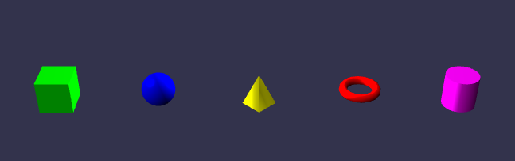
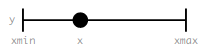
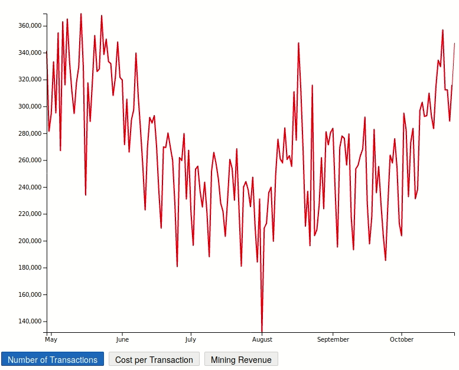
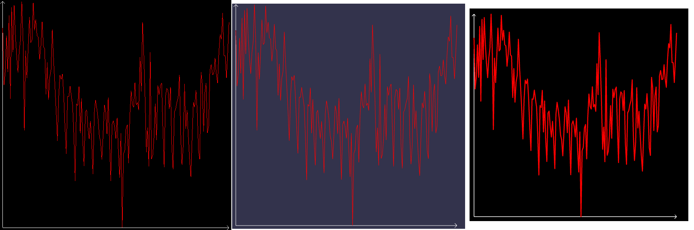

# WebGL

WebGL ist eine 3D Grafik API basierend auf OpenGL (genauer, OpenGL ES, für Embedded Systems). Die API ist für Verwendung in Javascript/ECMAScript in HTML5 gedacht und somit für alle Platformen die HTML5 unterstützen verfügbar.

Mit WebGL gerenderte Elemente werden im HTML Canvas Element dargestellt, mit Hilfe eines eigens definierten RenderingContext, **WebGLRenderingContext**, welcher den standardmäßigen CanvasRenderingContext2D ersetzt.

Die API ist low-level OpenGL, und enthält nahezu keinen boilerplate code, d.h. direktes Arbeiten mit Vertices und Framebuffern. Der Grund dafür ist, dass die API möglichst simpel und flexibel bleiben soll. Es existieren jedoch mehrere Bibliotheken die auf bestimmte use-cases zugeschnitten sind.

## Relevante Bibliotheken

|Name|WebGL Support| Basis Features | Zusatzfunktionen | Fazit |
|----|-------------|----------------|------------------|-------|
| [**three.js**](https://d3js.org/) | WebGL 1.0, begrenzt 2.0 | Licht/Schatten, Kamera, Material, Animation | Natives laden von .obj, .mtl, .gltf, .svg; Diverse Plugins, z.B. Physijs als Physics-Engine | Grundsätzliche Funktionen, aber trotzdem noch sehr nah an OpenGL, wenig modern|
| [**BabylonJS**](https://www.babylonjs.com/) | WebGL 2.0 | Licht/Schatten, Kamera, Material, Animation, Shader | Mesh + Morph, Physics- und Collision-Engine, Partikel System, Audio-Engine, FX Toolkit (Fog, Shadow Maps, Anti-Aliasing, Glow) | Deutlich mehr Funktionen (dadurch aber auch mehr bloat), größere Community, volles Toolkit für Spiel-Design|
| [**D3.js**](https://d3js.org/) | - | Datenverarbeitung, SVG und DOM-Manipulation, Dynamische Änderung & Animation (geringe Performanz) | | Sinnvoll als teil eines Hybriden ansatzes, z.B. zum Zeichnen von statischen Elementen (Koordinaten System)|
| [**StardustJS**](https://stardustjs.github.io/) | Unbekannt, aber für Anwendung irrelevant | Datenvisualisierung, Databinding, 2D & 3D | | Einzig für (animierte) Datenvisualisierung, gut für große Datenmengen, mehr Potential als SVG Darstellung |


## 3D WebGL mit BabylonJS

Babylon ist primär für 3D Darstellung gedacht und ein Großteil der Features fällt in die Kategorie Gamedesign. Funktionen wie eine Integriere Physicsengine, FX und Partikel sind hierfür durchaus hilfreich. Die grundlegenden Funktionen in Babylon sind jedoch auch diverse andere Anwendungsfälle nützlich.

In seiner Struktur und im Programmier-Ansatz ist die Bibliothek offensichtlich Objektorientiert aufgebaut. Die Szene, so wie Licht, Kamera und alle Meshes, werden als Objekte ihrer jeweiligen Klasen instantiiert und positioniert. Meshes bekommen Materialien zugewiesen, Kameras und Lichtquellen haben diverse manipulierbare Attribute. Auch die Physicsengine funktioniert mit sogenannten „Imposter“ Klassen, die ihre jeweiligen Verhalten bestimmen. Damit ist Babylon leicht zu strukturieren und in Komponenten zu teilen und erlaubt eine sehr hohe Konfigurierbarkeit.

```javascript
function createScene() {	
	//Szene
	var scene = new BABYLON.Scene(engine);

	//Licht
	var light = new BABYLON.HemisphericLight("light1", new BABYLON.Vector3(1, 1, 0), scene);

	//Kamera
	var camera = new BABYLON.UniversalCamera("UniversalCamera", new BABYLON.Vector3(0, 0, -10), scene);
	//Kamera Steuerung
	camera.attachControl(canvas, true);

	//Kugel
	var sphere = BABYLON.MeshBuilder.CreateSphere("sphere", {diameter:1}, scene);

	return scene;
}
```
*Aufbau einer einfachen Szene mit Licht, Kamera und Kugel Mesh*

Meshes können in diversen Formaten importiert werden (wie z.B. glTF oder obj), jedoch biete die Bibliothek auch Hilfsmethoden an, mit denen alle gängigen euklidischen Körper (Würfel, Kugel, Zylinder, Kegel, Torus) generiert werden können. 



*Eine Auswahl von Meshes die mit Babylon generiert werden können*

## Datenvisualisierung mit StardustJS und D3.js

Stardust ist als Bibliothek ganz auf effiziente, GPU-basierte, Datenvisualisierung ausgelegt. Dazu werden "Marks" verwendet, dies sind quasi die Objekte/Meshes die speichern jedoch noch zusätzliche Informationen, denn Stardust dient gleichermaßen auch der Datenverarbeitung.

Die Bibliothek enthält eine Reihe von bereits definierten Marks, z.B. Kreis, Rechteck, Linie, Polylinie, ermöglicht allerdings auch dem Nutzer, eigene Marks zu definieren:
```ts
//Bestehende Marks
import{ Circle, Line }fromP2D;

//Vertikale Linie
mark VLine(x: float, y: float) {
	Line(Vector2(x, y - 3), Vector2(x, y + 3), 1);
}

//Neues Mark
mark RangeBarWithCircle(x: float, y: float, xmin: float, xmax: float) {
	//Zwei vertikale Linien
	VLine(xmin, y);
	VLine(xmax, y);
	// Linie und Kreis
	Line(Vector2(xmin, y), Vector2(xmax, y), 1);
	Circle(Vector2(x, y), 2);
}
```


*Durch den obrigen Code definiert sich dieses Mark. [Quelle](https://donghaoren.org/publications/eurovis17-stardust.pdf)*

Interessant wird Stardust besonders in Kombination mit D3.js, eine Bibliothek die diverse Datenmengen verarbeiten kann, und diese zwar in SVG darstellen kann, jedoch dabei längst nicht so performant ist wie eine WebGL Implementation. Ein hybrider Ansatz ist jedoch durchaus möglich: So wurden im folgenden Beispiel die Daten einer csv Datei erst eingelesen und mit D3 die Domänen eingeschränkt, dann mit Stardust der Graph als Polylinie im Canvas Element visualisiert. Die Koordinatenachsen sind in mit D3 in einem darüber liegenden SVG Element dargestellt. Die Übergänge zwischen den drei Graphen wiederum laufen über eine Utility Funktion von Stardust



*Hybride Graphendarstellung eines Datensets mit StardustJS und D3.js*

## Performance: three.js vs BabylonJS vs StardustJS
Um besser bewerten zu können welche Bibliothek sich für gewisse Projekte eignet, habe ih mich entschlossen einen kleinen Vergleich aufzustellen.
Dabei ist eine Aufgabe mit Ziel vorgegeben die in der jeweiligen Render-Bibliothek möglichst effizient umgesetzt wird. Danach wird die Laufzeit in ms gemessen und die Anzahl der Codezeilen gezählt und aus diesen Werten ein Vergleich erstellt.

### Die Aufgabe:
Darstellung eines Graphen samt mit Koordinatensystem, jedoch ohne Beschriftung. Gegeben dafür sind: Das Datenset, die X- und Y-Keys für Werte im Set und zwei Skalierungsfunktionen um die Werte auf den Achsen zu bestimmen.

### Ergebnisse:

*Ergebnis des Renders, L>R: three.js, BabylonJS, StardustJS*

Laufzeit wurde gemessen über 50 Versuche und dann der Durchschnitt ermittelt.

| Bibliothek | Laufzeit (Ø) | Laufzeit (Best) | Laufzeit (Worst) | Codezeilen |
|---------|-------|-------|-------|-------|
| three.js | 64,45 ms | 55 ms | 84 ms | 12 |
| BabylonJS | 81 ms | 72 ms | 94 ms | 13 |
| StardustJS | 158,5 ms | 150 ms | 201 ms | 12 |

### Fazit: 

Die Anzahl der Codezeilen und der eigentliche Aufbau des Codes ist für alle drei Bibliotheken ähnlich, bei three und Babylon sogar nahezu gleich. Stardust definitiert seine Marks etwas anders.
In der Laufzeit entäuscht StardustJS, weswegen ich derzeit keinen Vorteil in ihrer Verwendung sehe. Babylon liegt etwas hinter three, jedoch ist der Abstand gering im vergleich zu Stardust. Ich denke sowohl three als auch Babylon sind sinnvolle Ansätze in diesem Beispiel.